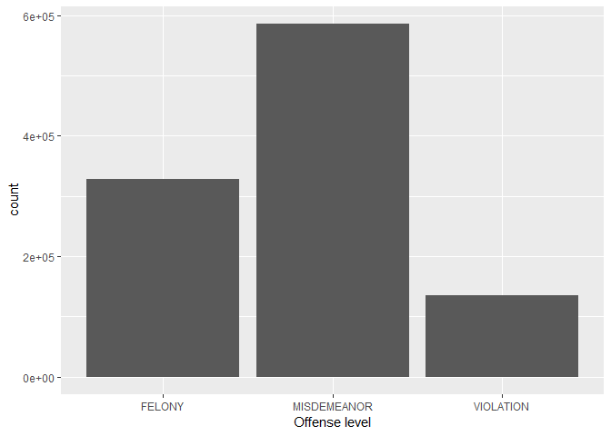
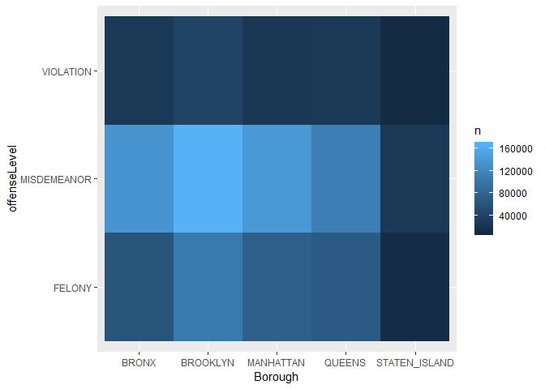
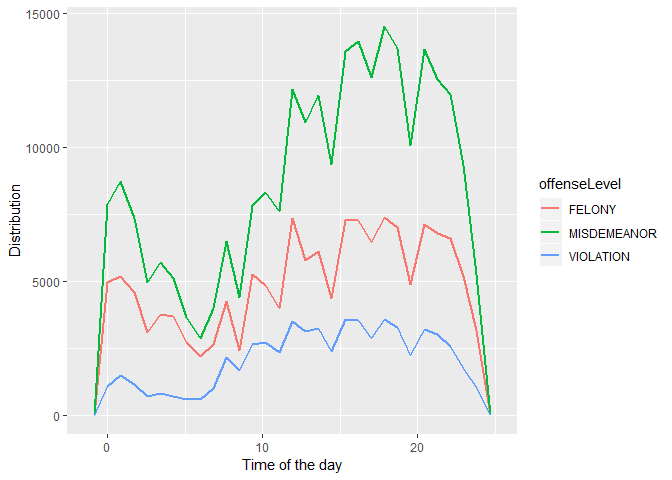
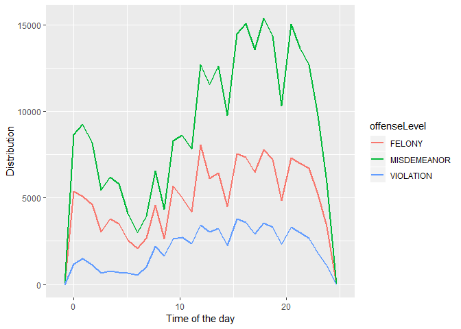
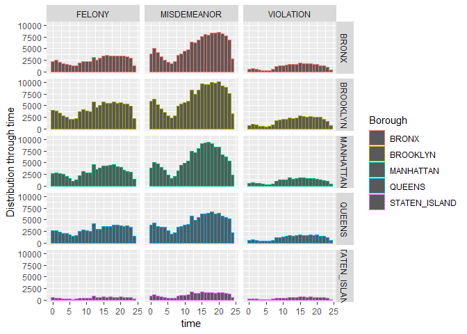
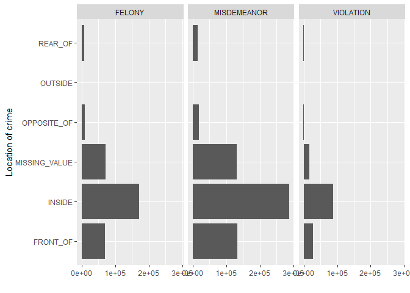

### Introduction
This project is made for purpose of Data mining course - Mathematics and Computer science department <br>
Original data from Kaggle: https://www.kaggle.com/adamschroeder/crimes-new-york-city/version/1 <br>
Data : New York crime data <br>
Objective : extraction of knowledge related to crimes from dataset <br>
General purpose of this project is not classic classification of regression problems, but finding out important features of crime nature in New York.

### Software
R programming language (version 3.6.0) <br>
RStudio <br>
Jupyter Notebook

### R Libraries


```r
library(dplyr)
```

```
## 
## Attaching package: 'dplyr'
```

```
## The following objects are masked from 'package:stats':
## 
##     filter, lag
```

```
## The following objects are masked from 'package:base':
## 
##     intersect, setdiff, setequal, union
```

```r
library(ggplot2)
```

```
## Registered S3 methods overwritten by 'ggplot2':
##   method         from 
##   [.quosures     rlang
##   c.quosures     rlang
##   print.quosures rlang
```

```r
library(DT)
library(arules)
```

```
## Loading required package: Matrix
```

```
## 
## Attaching package: 'arules'
```

```
## The following object is masked from 'package:dplyr':
## 
##     recode
```

```
## The following objects are masked from 'package:base':
## 
##     abbreviate, write
```

### Data


```r
crimeData = read.csv(file = "./CrimeData.csv",header = T,sep = ',')
crimeData[sample(x = 1:1048575,size = 15),] # a brief look at the data
```

```
##         day month year  time       Borough dayPart Latitude Longitude
## 439368    5     2 2015  1.47         BRONX   22-06 40.82012 -73.81787
## 982810   21    12 2013  0.33      BROOKLYN   22-06 40.65068 -74.01350
## 192952    7     8 2015 16.00         BRONX   12-17 40.82937 -73.90879
## 700531   20     7 2014 15.00      BROOKLYN   12-17 40.61072 -73.92099
## 939193   25     1 2014 10.17     MANHATTAN   06-12 40.80438 -73.93742
## 1026430  20     9 2013  8.00        QUEENS   06-12 40.70360 -73.79220
## 192643   10     8 2015  0.02        QUEENS   22-06 40.75454 -73.89513
## 651607   22     8 2014  4.83        QUEENS   22-06 40.70228 -73.81153
## 458139   19     1 2015 12.83      BROOKLYN   12-17 40.65922 -73.93509
## 849854    3     4 2014 17.00 STATEN_ISLAND   12-17 40.54861 -74.15998
## 1029640  15    11 2013 15.65         BRONX   12-17 40.89241 -73.85793
## 268764   17     6 2015 21.00         BRONX   17-22 40.88412 -73.84897
## 878217   14    11 2013 12.00     MANHATTAN   06-12 40.81671 -73.96063
## 715123   10     7 2014  1.92      BROOKLYN   22-06 40.69088 -73.97879
## 347093   21     4 2015 19.25         BRONX   17-22 40.89477 -73.85305
##                       offenseDescription
## 439368  CRIMINAL_MISCHIEF_AND_RELATED_OF
## 982810                    FELONY_ASSAULT
## 192952                          BURGLARY
## 700531                     PETIT_LARCENY
## 939193                   DANGEROUS_DRUGS
## 1026430   GRAND_LARCENY_OF_MOTOR_VEHICLE
## 192643  CRIMINAL_MISCHIEF_AND_RELATED_OF
## 651607                      HARRASSMENT_
## 458139                           ROBBERY
## 849854    OFF_AGNST_PUB_ORD_SENSBLTY_AND
## 1029640                    PETIT_LARCENY
## 268764                   DANGEROUS_DRUGS
## 878217                     GRAND_LARCENY
## 715123                     PETIT_LARCENY
## 347093                           ROBBERY
##                                                pdDescription
## 439368                             MISCHIEF_CRIMINAL_UNCL_ND
## 982810                                  ASSAULT_UNCLASSIFIED
## 192952                                BURGLARY_RESIDENCE_DAY
## 700531                        LARCENY_PETIT_FROM_BUILDING_UN
## 939193                         CONTROLLED_SUBSTANCE_POSSESSI
## 1026430                                LARCENY_GRAND_OF_AUTO
## 192643                         CRIMINAL_MISCHIEF__TH_GRAFFIT
## 651607                              HARASSMENT_SUBD_CIVILIAN
## 458139                                      ROBBERY_DWELLING
## 849854                                AGGRAVATED_HARASSMENT_
## 1029640                       LARCENY_PETIT_FROM_STORE_SHOPL
## 268764                              MARIJUANA_POSSESSION___5
## 878217  LARCENY_GRAND_BY_FALSE_PROMISE_NOT_IN_PERSON_CONTACT
## 715123                              LARCENY_PETIT_OF_BICYCLE
## 347093                    ROBBERY_PERSONAL_ELECTRONIC_DEVICE
##         crimeCompleted offenseLevel occurenceLocation
## 439368       COMPLETED       FELONY            INSIDE
## 982810       COMPLETED       FELONY          FRONT_OF
## 192952       COMPLETED       FELONY            INSIDE
## 700531       COMPLETED  MISDEMEANOR            INSIDE
## 939193       COMPLETED  MISDEMEANOR     MISSING_VALUE
## 1026430      COMPLETED       FELONY       OPPOSITE_OF
## 192643       COMPLETED  MISDEMEANOR          FRONT_OF
## 651607       COMPLETED    VIOLATION     MISSING_VALUE
## 458139       COMPLETED       FELONY            INSIDE
## 849854       COMPLETED  MISDEMEANOR            INSIDE
## 1029640      COMPLETED  MISDEMEANOR            INSIDE
## 268764       COMPLETED  MISDEMEANOR            INSIDE
## 878217       COMPLETED       FELONY            INSIDE
## 715123       COMPLETED  MISDEMEANOR          FRONT_OF
## 347093       COMPLETED       FELONY     MISSING_VALUE
##               premiseDescription
## 439368            GROCERY_BODEGA
## 982810                    STREET
## 192952         CONSTRUCTION_SITE
## 700531          DEPARTMENT_STORE
## 939193                 FAST_FOOD
## 1026430                   STREET
## 192643       COMMERCIAL_BUILDING
## 651607                    STREET
## 458139           RESIDENCE_HOUSE
## 849854           RESIDENCE_HOUSE
## 1029640               DRUG_STORE
## 268764  RESIDENCE_PUBLIC_HOUSING
## 878217       RESIDENCE_APT_HOUSE
## 715123                    STREET
## 347093                    STREET
```

There is a difference beetwen this data and original from Kaggle. <br>
Simple preprocessing is made and some variables(date event was reported,police jurisdiction...) are ejected, some are changed(date variable to month, day and year, hours and minutes to time...) and some are added(dayPart) due to simplicity.
Variables "hours" and "minutes" are joined into 1 continuous variable time - for instance:
15h 30min is now 15.5  (15 + 30/60). <br>
Variable "time" is divided into categorical variable "dayPart" with 4 classes(parts of the day). <br>
All NA's are replaced with "MISSING_VALUE"


```r
summary(crimeData)
```

```
##       day            month             year           time      
##  Min.   : 1.00   Min.   : 1.000   Min.   :1015   Min.   : 0.00  
##  1st Qu.: 8.00   1st Qu.: 4.000   1st Qu.:2014   1st Qu.: 9.00  
##  Median :15.00   Median : 7.000   Median :2014   Median :14.67  
##  Mean   :15.52   Mean   : 6.947   Mean   :2014   Mean   :13.51  
##  3rd Qu.:23.00   3rd Qu.:10.000   3rd Qu.:2015   3rd Qu.:19.00  
##  Max.   :31.00   Max.   :12.000   Max.   :2015   Max.   :23.98  
##  NA's   :65      NA's   :65       NA's   :65                    
##           Borough        dayPart          Latitude       Longitude     
##  BRONX        :227477   06-12:220746   Min.   :40.50   Min.   :-74.26  
##  BROOKLYN     :315648   12-17:279515   1st Qu.:40.67   1st Qu.:-73.97  
##  MANHATTAN    :244749   17-22:291612   Median :40.73   Median :-73.93  
##  QUEENS       :211958   22-06:256702   Mean   :40.73   Mean   :-73.93  
##  STATEN_ISLAND: 48743                  3rd Qu.:40.81   3rd Qu.:-73.88  
##                                        Max.   :40.91   Max.   :-73.70  
##                                        NA's   :32417   NA's   :32417   
##                         offenseDescription
##  PETIT_LARCENY                   :180246  
##  HARRASSMENT_                    :133179  
##  ASSAULT_AND_RELATED_OFFENSES    :114430  
##  CRIMINAL_MISCHIEF_AND_RELATED_OF:102771  
##  GRAND_LARCENY                   : 96232  
##  DANGEROUS_DRUGS                 : 56868  
##  (Other)                         :364849  
##                         pdDescription          crimeCompleted   
##  ASSAULT                       : 93214   ATTEMPTED    :  18758  
##  HARASSMENT_SUBD___5           : 89064   COMPLETED    :1029816  
##  LARCENY_PETIT_FROM_STORE_SHOPL: 57638   MISSING_VALUE:      1  
##  LARCENY_PETIT_FROM_BUILDING_UN: 47733                          
##  AGGRAVATED_HARASSMENT_        : 44820                          
##  HARASSMENT_SUBD_CIVILIAN      : 44116                          
##  (Other)                       :671990                          
##       offenseLevel        occurenceLocation 
##  FELONY     :327807   FRONT_OF     :230557  
##  MISDEMEANOR:585468   INSIDE       :549718  
##  VIOLATION  :135300   MISSING_VALUE:217752  
##                       OPPOSITE_OF  : 27135  
##                       OUTSIDE      :   445  
##                       REAR_OF      : 22968  
##                                             
##                 premiseDescription
##  STREET                  :320261  
##  RESIDENCE_APT_HOUSE     :229490  
##  RESIDENCE_HOUSE         : 97446  
##  RESIDENCE_PUBLIC_HOUSING: 79577  
##  OTHER                   : 28726  
##  COMMERCIAL_BUILDING     : 27212  
##  (Other)                 :265863
```

### Data visualization
The most crimes generally occur in Brooklyn while least number of crimes occur in Staten Island.


```r
options(repr.plot.width=7, repr.plot.height=5)
ggplot(data = crimeData) + geom_bar(mapping = aes(x = crimeData$Borough,color = Borough))+
xlab("New York boroughs") + ylab("Num. of crimes")
```

<!-- -->

Distribution of "offense level" variable <br>
Misdemeanor offense dominate over felony and violation.

```r
options(repr.plot.width=5, repr.plot.height=5)
ggplot(data = crimeData) + geom_bar(mapping = aes(x = crimeData$offenseLevel)) + xlab("Offense level")
```

<!-- -->

## Simple correlations in data
Connection beetwen New York borough and offense level for newer data(2012-2015)

```r
options(repr.plot.width=7, repr.plot.height=3)
subset(crimeData,year >= 2012) %>% count(Borough , offenseLevel) %>% 
ggplot(mapping = aes(x = Borough , y = offenseLevel)) + 
geom_tile(mapping = aes(fill = n))
```

<!-- -->

Distribution of each offense level through the day. <br>
It is clear that second part of the day (17-21) is the time when most crimes of each level occur and the morning is the part of the day with less crime appearances.

```r
options(repr.plot.width=12, repr.plot.height=5)
ggplot(crimeData , mapping = aes(x = time,colour = offenseLevel))+ 
geom_freqpoly(binwidth = 0.9 , lwd = 1) + xlab("Time of the day")+ylab('Distribution')
```

<!-- -->

This trend don't change over time. <br>
The similar pattern occur if one smaller subset(44% of data) of data is taken 
(only crimes from last year - 2015)

```r
options(repr.plot.width=9, repr.plot.height=5)
subset(crimeData,year == 2015) %>%
ggplot(mapping = aes(x = time,colour = offenseLevel))+geom_freqpoly(binwidth = 0.85 , lwd = 1) + 
xlab("Time of the day")+ylab('Distribution')
```

<!-- -->

2014 year

```r
options(repr.plot.width=9, repr.plot.height=5)
subset(crimeData,year == 2014) %>%
ggplot(mapping = aes(x = time,colour = offenseLevel))+geom_freqpoly(binwidth = 0.85 , lwd = 1) + 
xlab("Time of the day")+ylab('Distribution')
```

<!-- -->

Relation beetwen New York boroughs, offense level and time. <br>
Crime offense levels mostly don't depend on borough but on time od the day.

```r
options(repr.plot.width=10, repr.plot.height=7)
qplot(data = subset(crimeData,year >= 2012) ,color =Borough, x = time , bins = 25 , ylab = "Distribution through time") + facet_grid(Borough~offenseLevel)
```

<!-- -->

Offense level vs. crime location <br>
Inside crimes are dominant independently of crime level.

```r
qplot(data = subset(crimeData,year >= 2013) , x = occurenceLocation,xlab = "Location of crime")+
facet_grid(.~offenseLevel) + coord_flip()
```

<!-- -->

### How to get some new information - simple example
One of the main tasks of data mining is extraction new data and information from the old one.
Here is a very simple example of getting day of the week from a given date.

```r
crimeData[15] <- crimeData[,c(3,2,1)] %>% apply(MARGIN = 1,
FUN = function(vec){paste(vec,collapse = '-')}) %>% as.Date() %>% weekdays()
names(crimeData)[15] <- 'weekDay'
```

### Day of the week vs. time (year 2014 and 2015)
As it can be seen, the most dangerous time of the week is weekend night(saturday and sunday 22-06) and middle of the week through the day, while the less dangerous is the middle of the week at night and weekend mornings. 
For this and similar analysis, the idea is to track new trends that might happen and for that reason newer data should be taken for analysis(in this case last 2 years).

```r
subset(crimeData,!is.na(weekDay) & year >= 2014) %>% count(weekDay , dayPart) %>% 
ggplot(mapping = aes(x = weekDay , y = dayPart)) + geom_tile(mapping = aes(fill = n))+
xlab("Day of the week") + ylab("Part of the day")
```

<!-- -->

### Some things happen more often than the others - interactive data tables
For this kind of analysis DT(data-table) library is used - simple review of particular desired events. <br>
From this data-tables it is easy to observe what events are more frequent than the others.

```r
subset(crimeData,year >= 2014 & occurenceLocation != "MISSING_VALUE") %>% 
group_by(offenseDescription,Borough,dayPart,premiseDescription) %>% summarize(count = n()) %>% 
arrange(desc(count)) %>% head(20) %>% datatable(options = list(pageLength = 10,scrollX='400px'))
```

<!--html_preserve--><div id="htmlwidget-ece90d223c6c66f6e753" style="width:100%;height:auto;" class="datatables html-widget"></div>
<script type="application/json" data-for="htmlwidget-ece90d223c6c66f6e753">{"x":{"filter":"none","data":[["1","2","3","4","5","6","7","8","9","10","11","12","13","14","15","16","17","18","19","20"],["HARRASSMENT_","ASSAULT_AND_RELATED_OFFENSES","ASSAULT_AND_RELATED_OFFENSES","HARRASSMENT_","HARRASSMENT_","ASSAULT_AND_RELATED_OFFENSES","HARRASSMENT_","PETIT_LARCENY","ASSAULT_AND_RELATED_OFFENSES","PETIT_LARCENY","CRIMINAL_MISCHIEF_AND_RELATED_OF","HARRASSMENT_","PETIT_LARCENY","HARRASSMENT_","HARRASSMENT_","BURGLARY","HARRASSMENT_","HARRASSMENT_","GRAND_LARCENY","PETIT_LARCENY"],["BROOKLYN","BRONX","BROOKLYN","BROOKLYN","BROOKLYN","BROOKLYN","BRONX","BROOKLYN","BRONX","MANHATTAN","BROOKLYN","BRONX","MANHATTAN","BRONX","BROOKLYN","BROOKLYN","MANHATTAN","QUEENS","MANHATTAN","BROOKLYN"],["17-22","22-06","22-06","06-12","12-17","17-22","17-22","17-22","17-22","12-17","17-22","12-17","12-17","06-12","22-06","06-12","17-22","17-22","06-12","12-17"],["RESIDENCE_APT_HOUSE","RESIDENCE_APT_HOUSE","RESIDENCE_APT_HOUSE","RESIDENCE_APT_HOUSE","RESIDENCE_APT_HOUSE","RESIDENCE_APT_HOUSE","RESIDENCE_APT_HOUSE","STREET","RESIDENCE_APT_HOUSE","DEPARTMENT_STORE","STREET","RESIDENCE_APT_HOUSE","CHAIN_STORE","RESIDENCE_APT_HOUSE","RESIDENCE_APT_HOUSE","RESIDENCE_APT_HOUSE","RESIDENCE_APT_HOUSE","RESIDENCE_APT_HOUSE","RESIDENCE_APT_HOUSE","STREET"],[4307,3648,3520,3437,3337,3328,3293,3264,3244,3016,2951,2943,2867,2834,2776,2385,2381,2339,2293,2266]],"container":"<table class=\"display\">\n  <thead>\n    <tr>\n      <th> <\/th>\n      <th>offenseDescription<\/th>\n      <th>Borough<\/th>\n      <th>dayPart<\/th>\n      <th>premiseDescription<\/th>\n      <th>count<\/th>\n    <\/tr>\n  <\/thead>\n<\/table>","options":{"pageLength":10,"scrollX":"400px","columnDefs":[{"className":"dt-right","targets":5},{"orderable":false,"targets":0}],"order":[],"autoWidth":false,"orderClasses":false}},"evals":[],"jsHooks":[]}</script><!--/html_preserve-->


```r
subset(crimeData,year >= 2014 & occurenceLocation != "MISSING_VALUE") %>% 
group_by(occurenceLocation,Borough,dayPart,pdDescription) %>% summarize(count = n()) %>% 
arrange(desc(count)) %>% head(20) %>% datatable(options = list(pageLength = 10,scrollX='400px'))
```

<!--html_preserve--><div id="htmlwidget-42250f8db0ff46d49b1e" style="width:100%;height:auto;" class="datatables html-widget"></div>
<script type="application/json" data-for="htmlwidget-42250f8db0ff46d49b1e">{"x":{"filter":"none","data":[["1","2","3","4","5","6","7","8","9","10","11","12","13","14","15","16","17","18","19","20"],["INSIDE","INSIDE","INSIDE","INSIDE","INSIDE","INSIDE","INSIDE","INSIDE","INSIDE","INSIDE","INSIDE","INSIDE","INSIDE","INSIDE","INSIDE","INSIDE","INSIDE","INSIDE","INSIDE","INSIDE"],["MANHATTAN","MANHATTAN","BROOKLYN","BROOKLYN","BROOKLYN","BROOKLYN","BROOKLYN","BROOKLYN","QUEENS","MANHATTAN","BRONX","BRONX","BROOKLYN","BRONX","BROOKLYN","QUEENS","BRONX","MANHATTAN","MANHATTAN","BROOKLYN"],["12-17","17-22","12-17","06-12","17-22","12-17","22-06","17-22","12-17","12-17","22-06","12-17","12-17","17-22","17-22","22-06","12-17","17-22","12-17","12-17"],["LARCENY_PETIT_FROM_STORE_SHOPL","LARCENY_PETIT_FROM_STORE_SHOPL","LARCENY_PETIT_FROM_STORE_SHOPL","HARASSMENT_SUBD___5","HARASSMENT_SUBD___5","HARASSMENT_SUBD___5","ASSAULT","ASSAULT","LARCENY_PETIT_FROM_STORE_SHOPL","LARCENY_PETIT_FROM_BUILDING_UN","ASSAULT","LARCENY_PETIT_FROM_STORE_SHOPL","LARCENY_PETIT_FROM_BUILDING_UN","ASSAULT","LARCENY_PETIT_FROM_STORE_SHOPL","ASSAULT","HARASSMENT_SUBD___5","LARCENY_PETIT_FROM_BUILDING_UN","HARASSMENT_SUBD___5","ASSAULT"],[9784,6700,5062,4902,4855,4840,4816,4351,4326,4183,3983,3946,3714,3621,3617,3344,3327,3291,3246,3208]],"container":"<table class=\"display\">\n  <thead>\n    <tr>\n      <th> <\/th>\n      <th>occurenceLocation<\/th>\n      <th>Borough<\/th>\n      <th>dayPart<\/th>\n      <th>pdDescription<\/th>\n      <th>count<\/th>\n    <\/tr>\n  <\/thead>\n<\/table>","options":{"pageLength":10,"scrollX":"400px","columnDefs":[{"className":"dt-right","targets":5},{"orderable":false,"targets":0}],"order":[],"autoWidth":false,"orderClasses":false}},"evals":[],"jsHooks":[]}</script><!--/html_preserve-->

### Felony
2015 felony related crimes - small pattern emerges. <br>
The most dangerous place for this specific category is Brooklyn - 12 h, at beginning of the week. The same pattern come up for 2014 year.

```r
subset(crimeData,year == 2015 & offenseLevel == "FELONY") %>% group_by(Borough,time,weekDay) %>% summarise(count = n()) %>% 
arrange(desc(count)) %>% head(30) %>% datatable(options = list(pageLength = 10,scrollX='400px'))
```

<!--html_preserve--><div id="htmlwidget-5da0fbb0274726b1a710" style="width:100%;height:auto;" class="datatables html-widget"></div>
<script type="application/json" data-for="htmlwidget-5da0fbb0274726b1a710">{"x":{"filter":"none","data":[["1","2","3","4","5","6","7","8","9","10","11","12","13","14","15","16","17","18","19","20","21","22","23","24","25","26","27","28","29","30"],["BROOKLYN","BROOKLYN","BROOKLYN","BROOKLYN","BROOKLYN","BROOKLYN","QUEENS","MANHATTAN","MANHATTAN","BROOKLYN","MANHATTAN","BROOKLYN","BROOKLYN","BROOKLYN","QUEENS","MANHATTAN","QUEENS","BROOKLYN","BROOKLYN","BROOKLYN","BROOKLYN","MANHATTAN","BROOKLYN","BROOKLYN","MANHATTAN","BROOKLYN","BROOKLYN","BROOKLYN","BROOKLYN","BROOKLYN"],[12,12,12,15,12,12,12,12,12,17,12,15,18,16,12,12,12,9,17,15,20,12,12,15,17,9,15,17,19,13],["Monday","Friday","Tuesday","Friday","Thursday","Wednesday","Monday","Friday","Thursday","Friday","Tuesday","Monday","Friday","Friday","Friday","Wednesday","Wednesday","Friday","Monday","Tuesday","Friday","Monday","Saturday","Thursday","Friday","Wednesday","Wednesday","Thursday","Friday","Wednesday"],[228,217,214,199,192,190,179,177,173,172,167,166,166,165,165,164,162,160,160,157,157,157,155,154,151,150,147,146,146,145]],"container":"<table class=\"display\">\n  <thead>\n    <tr>\n      <th> <\/th>\n      <th>Borough<\/th>\n      <th>time<\/th>\n      <th>weekDay<\/th>\n      <th>count<\/th>\n    <\/tr>\n  <\/thead>\n<\/table>","options":{"pageLength":10,"scrollX":"400px","columnDefs":[{"className":"dt-right","targets":[2,4]},{"orderable":false,"targets":0}],"order":[],"autoWidth":false,"orderClasses":false}},"evals":[],"jsHooks":[]}</script><!--/html_preserve-->

## Association rules
Association rules are rule-based data mining method for discovering certain relations between variables in data-sets. The main purpose of association rules is to discover strong rules in data-sets using measures of interestingness. <br> Let $I=\{i_1,...,i_n\}$ be the set of variables in the dataset. Observations of data-set (rows of data frame) are usually called **transactions**.
A rule is defined like implication $A \implies B$ where $A,B \subset I$.<br> $A$ is usually called antecedent or left-hand-side (LHS) and $Y$ consequent or right-hand-side (RHS).
In some implementations rule is defined like $A \implies i_j$ where $i_j \in I$.

### Significant measures
Let $X,Y$ be itemsets, $X \implies Y$ an association rule and $T$ a set of transactions of a given data-set.

### Support

Support is an indication of how frequently the itemset appears in the dataset. <br>
It is proportion of transactions(rows in data frame) that contain specific itemset, with respect to number of transactions. <br>
$supp(X) = \frac{|t \in T ; X \subset t|}{|T|}$ <br>

### Confidence

Confidence is an indication of how often the rule has been found to be true.<br>
$conf(X \cup Y) = \frac{supp(X \cup Y)}{supp(X)}$ <br>
Confidence can be interpreted as an estimate of the conditional probability $P(Y|X)$, the probability of finding the $Y$ in transactions under the condition that these transactions also contain the $X$ in the left side of the rule.

### The lift

The lift of a rule is defined as $lift(X \implies Y) = \frac{supp(X \cup Y)}{supp(X) * supp(Y)}$<br>
It is the ratio of the observed support to that expected if X and Y were independent events. <br> If $X$ and $Y$ are truly independent events, we can expect that about $supp(X) * supp(Y)$ number of transactions will contain both of them. <br>
If the rule had a **lift of 1**, it would imply that the probability of occurrence of the antecedent and that of the consequent are independent of each other. When two events are independent of each other, no rule can be drawn involving those two events. <br>
If the **lift is > 1**, that lets us know the degree to which those two occurrences are dependent on one another, and makes those rules potentially useful for predicting the consequent in future data sets.<br>
If the **lift is < 1**, that lets us know the items are substitute to each other. This means that presence of one item has negative effect on presence of other item and vice versa. <br><br>
Definitons taken from : https://en.wikipedia.org/wiki/Association_rule_learning <br>
R implementation: library arules , apriori algorithm.<br><br>

### Example - wrong way of using association rules
One of the obvious wrong ways of using of association rules is to apply it to variables that are obviously correlated in some way. In this dataset for instance we could get rule like: <br>
offenseDescription = ASSAULT_AND_RELATED_OFFENSES $\implies$ pdDescription = ASSAULT. It is clear and natural that these 2 variables are in close relationship, so although this rule might have large lift, is not very helpfull. For this reason in examples below algorithm will take only some subset of variables, excluding others that are obviously correlated with them.<br><br>

### Apriori algorithm
Apriori algorithm is classic algorithm for generating association rules from datasets or databases.<br>
The key idea of the algorithm is to begin by generating frequent itemsets with just one item (1-itemsets) and to recursively generate frequent itemsets with 2 items, then frequent 3-itemsets and so on till some stopping condition is satisfied. <br> 
This is where computational complexity comes into the game. <br>
Apriori algorithm is based on very simple observation: **subsets of frequent itemsets are also frequent itemsets**. In other words , if some itemset is proven to be non-frequent , then it will not be considered by algorithm any more for forming new frequent itemsets. To identify the k-itemsets that are not frequent algorithm need to examine all subsets of size (k-1) of each candidate k-itemset.<br>
It generates candidate itemsets of length k from item sets of length k-1. Then it prunes the candidates which have an infrequent sub-pattern.


```r
rules <- apriori(data = subset(crimeData,year >= 2013)[,-c(1,2,3,6,7,8,9,10,11,14)] , 
parameter = list(support = 0.03 , confidence = 0.6,maxlen = 5,target = 'rules'))
```

```
## Warning: Column(s) 1, 5 not logical or factor. Applying default
## discretization (see '? discretizeDF').
```

```
## Apriori
## 
## Parameter specification:
##  confidence minval smax arem  aval originalSupport maxtime support minlen
##         0.6    0.1    1 none FALSE            TRUE       5    0.03      1
##  maxlen target   ext
##       5  rules FALSE
## 
## Algorithmic control:
##  filter tree heap memopt load sort verbose
##     0.1 TRUE TRUE  FALSE TRUE    2    TRUE
## 
## Absolute minimum support count: 31353 
## 
## set item appearances ...[0 item(s)] done [0.00s].
## set transactions ...[24 item(s), 1045101 transaction(s)] done [1.46s].
## sorting and recoding items ... [21 item(s)] done [0.12s].
## creating transaction tree ... done [4.40s].
## checking subsets of size 1 2 3 4 done [0.04s].
## writing ... [7 rule(s)] done [0.00s].
## creating S4 object  ... done [0.41s].
```

```r
inspect(sort(rules,by='lift'))
```

```
##     lhs                                  rhs                           support confidence     lift  count
## [1] {offenseLevel=VIOLATION}          => {occurenceLocation=INSIDE} 0.08360436  0.6466426 1.236093  87375
## [2] {time=[11.3,17.5),                                                                                   
##      Borough=MANHATTAN}               => {occurenceLocation=INSIDE} 0.05160458  0.6279414 1.200345  53932
## [3] {Borough=MANHATTAN,                                                                                  
##      offenseLevel=FELONY}             => {occurenceLocation=INSIDE} 0.04407995  0.6062536 1.158888  46068
## [4] {Borough=BRONX,                                                                                      
##      occurenceLocation=MISSING_VALUE} => {offenseLevel=MISDEMEANOR} 0.03050040  0.6278635 1.122953  31876
## [5] {time=[17.5,24],                                                                                     
##      Borough=BRONX}                   => {offenseLevel=MISDEMEANOR} 0.04869864  0.6273884 1.122103  50895
## [6] {time=[0,11.3),                                                                                      
##      occurenceLocation=MISSING_VALUE} => {offenseLevel=MISDEMEANOR} 0.04490858  0.6237491 1.115594  46934
## [7] {occurenceLocation=MISSING_VALUE} => {offenseLevel=MISDEMEANOR} 0.12501663  0.6005801 1.074156 130655
```
In the example above, the first couple of rules have the lift that is slightly greater than 1 which means there might be light correlation between these itemsets. On the other hand, this might be because value "INSIDE" (1st rule) for occurenceLocation is dominating over the other values of occurenceLocation. <br>
Intuitive way of interpreting this rule is something like "when crime belongs to the level VIOLATION, it is slightly more likely that it happened INSIDE than then somewhere else". <br>
However, confidence of this rule could be somewhat better so we can't accept that this is strong connection between these 2 variables although lift implies some dependence.

### Trying to detect what is the cause of rare events
From summary table it is clear that most crimes have value COMPLETED for category crimeCompleted, much less number of crimes are registered as just ATTEMPTED. Association rules could allow us to find some specific moments that imply this rare events. <br>
Although lift is really high for these events, their count is small(2-3) and these are not indicators of any kind of correlation with ATTEMPTED value.

```r
rules <- apriori(data = subset(crimeData,year >= 2011)[,c(4,5,9,11,14)] , 
parameter = list(support = 0.000001 , confidence = 0.85,maxlen = 5),
appearance = list(rhs = c('crimeCompleted=ATTEMPTED')))
```

```
## Warning: Column(s) 1 not logical or factor. Applying default discretization
## (see '? discretizeDF').
```

```
## Apriori
## 
## Parameter specification:
##  confidence minval smax arem  aval originalSupport maxtime support minlen
##        0.85    0.1    1 none FALSE            TRUE       5   1e-06      1
##  maxlen target   ext
##       5  rules FALSE
## 
## Algorithmic control:
##  filter tree heap memopt load sort verbose
##     0.1 TRUE TRUE  FALSE TRUE    2    TRUE
## 
## Absolute minimum support count: 1 
## 
## set item appearances ...[1 item(s)] done [0.00s].
## set transactions ...[150 item(s), 1046908 transaction(s)] done [1.74s].
## sorting and recoding items ... [146 item(s)] done [0.15s].
## creating transaction tree ... done [6.05s].
## checking subsets of size 1 2 3 4 5 done [0.09s].
## writing ... [10 rule(s)] done [0.01s].
## creating S4 object  ... done [0.55s].
```

```r
inspect(head(sort(rules,by='lift'),10))
```

```
##      lhs                                                     rhs                             support confidence     lift count
## [1]  {offenseDescription=FRAUDULENT_ACCOSTING,                                                                                
##       premiseDescription=PARKING_LOT_GARAGE_(PUBLIC)}     => {crimeCompleted=ATTEMPTED} 1.910388e-06          1 55.93055     2
## [2]  {offenseDescription=RAPE,                                                                                                
##       premiseDescription=BEAUTY_&_NAIL_SALON}             => {crimeCompleted=ATTEMPTED} 1.910388e-06          1 55.93055     2
## [3]  {time=[11.3,17.5),                                                                                                       
##       offenseDescription=RAPE,                                                                                                
##       premiseDescription=TRANSIT_NYC_SUBWAY}              => {crimeCompleted=ATTEMPTED} 2.865581e-06          1 55.93055     3
## [4]  {Borough=STATEN_ISLAND,                                                                                                  
##       offenseDescription=BURGLARY,                                                                                            
##       premiseDescription=BANK}                            => {crimeCompleted=ATTEMPTED} 1.910388e-06          1 55.93055     2
## [5]  {time=[11.3,17.5),                                                                                                       
##       Borough=MANHATTAN,                                                                                                      
##       offenseDescription=KIDNAPPING_AND_RELATED_OFFENSES,                                                                     
##       premiseDescription=STREET}                          => {crimeCompleted=ATTEMPTED} 1.910388e-06          1 55.93055     2
## [6]  {time=[0,11.3),                                                                                                          
##       Borough=MANHATTAN,                                                                                                      
##       offenseDescription=ROBBERY,                                                                                             
##       premiseDescription=BUS_STOP}                        => {crimeCompleted=ATTEMPTED} 1.910388e-06          1 55.93055     2
## [7]  {time=[17.5,24],                                                                                                         
##       Borough=MANHATTAN,                                                                                                      
##       offenseDescription=ROBBERY,                                                                                             
##       premiseDescription=BUS_STOP}                        => {crimeCompleted=ATTEMPTED} 2.865581e-06          1 55.93055     3
## [8]  {time=[11.3,17.5),                                                                                                       
##       Borough=MANHATTAN,                                                                                                      
##       offenseDescription=RAPE,                                                                                                
##       premiseDescription=TRANSIT_NYC_SUBWAY}              => {crimeCompleted=ATTEMPTED} 1.910388e-06          1 55.93055     2
## [9]  {time=[0,11.3),                                                                                                          
##       Borough=STATEN_ISLAND,                                                                                                  
##       offenseDescription=BURGLARY,                                                                                            
##       premiseDescription=BANK}                            => {crimeCompleted=ATTEMPTED} 1.910388e-06          1 55.93055     2
## [10] {time=[11.3,17.5),                                                                                                       
##       Borough=STATEN_ISLAND,                                                                                                  
##       offenseDescription=BURGLARY,                                                                                            
##       premiseDescription=SMALL_MERCHANT}                  => {crimeCompleted=ATTEMPTED} 1.910388e-06          1 55.93055     2
```

Greater count implies that we need to sacrifice confidence. <br>
Left-hand side of these rules with great lift value, contains some specific events like explicit part of the day when "KIDNAPPING_AND_RELATED_OFFENSES" crimes happend on the street.

```r
rules <- apriori(data = subset(crimeData,year >= 2013)[,c(4,5,9,11,14)] , 
parameter = list(support = 0.00001 , confidence = 0.55,maxlen = 5),
appearance = list(rhs = c('crimeCompleted=ATTEMPTED')))
```

```
## Warning: Column(s) 1 not logical or factor. Applying default discretization
## (see '? discretizeDF').
```

```
## Apriori
## 
## Parameter specification:
##  confidence minval smax arem  aval originalSupport maxtime support minlen
##        0.55    0.1    1 none FALSE            TRUE       5   1e-05      1
##  maxlen target   ext
##       5  rules FALSE
## 
## Algorithmic control:
##  filter tree heap memopt load sort verbose
##     0.1 TRUE TRUE  FALSE TRUE    2    TRUE
## 
## Absolute minimum support count: 10 
## 
## set item appearances ...[1 item(s)] done [0.00s].
## set transactions ...[150 item(s), 1045101 transaction(s)] done [2.31s].
## sorting and recoding items ... [135 item(s)] done [0.11s].
## creating transaction tree ... done [5.86s].
## checking subsets of size 1 2 3 4 5 done [0.05s].
## writing ... [3 rule(s)] done [0.00s].
## creating S4 object  ... done [0.57s].
```

```r
inspect(head(sort(rules,by='lift'),10))
```

```
##     lhs                                                     rhs                             support confidence     lift count
## [1] {time=[11.3,17.5),                                                                                                       
##      offenseDescription=KIDNAPPING_AND_RELATED_OFFENSES,                                                                     
##      premiseDescription=STREET}                          => {crimeCompleted=ATTEMPTED} 1.435268e-05  0.6521739 36.47975    15
## [2] {Borough=BRONX,                                                                                                          
##      offenseDescription=ROBBERY,                                                                                             
##      premiseDescription=CHECK_CASHING_BUSINESS}          => {crimeCompleted=ATTEMPTED} 1.339583e-05  0.5833333 32.62911    14
## [3] {time=[0,11.3),                                                                                                          
##      offenseDescription=ROBBERY,                                                                                             
##      premiseDescription=CHECK_CASHING_BUSINESS}          => {crimeCompleted=ATTEMPTED} 1.913691e-05  0.5555556 31.07534    20
```

Association rules allow us to discover nature of serious crimes, like burglary and larceny (for 2015 year). <br>
Rules with higher lift and confidence are good candidates for better research because they imply that there might be some connection between certain variables in this subset of data.

```r
rules <- apriori(data = subset(crimeData,year == 2015)[,c(4,5,9,11,14,15)] , 
parameter = list(support = 0.00001 , confidence = 0.7,maxlen = 5,target='rules'),
appearance = list(rhs = c('offenseDescription=BURGLARY')))
```

```
## Warning: Column(s) 1, 6 not logical or factor. Applying default
## discretization (see '? discretizeDF').
```

```
## Apriori
## 
## Parameter specification:
##  confidence minval smax arem  aval originalSupport maxtime support minlen
##         0.7    0.1    1 none FALSE            TRUE       5   1e-05      1
##  maxlen target   ext
##       5  rules FALSE
## 
## Algorithmic control:
##  filter tree heap memopt load sort verbose
##     0.1 TRUE TRUE  FALSE TRUE    2    TRUE
## 
## Absolute minimum support count: 4 
## 
## set item appearances ...[1 item(s)] done [0.00s].
## set transactions ...[154 item(s), 468576 transaction(s)] done [0.77s].
## sorting and recoding items ... [143 item(s)] done [0.06s].
## creating transaction tree ... done [2.32s].
## checking subsets of size 1 2 3 4 5
```

```
## Warning in apriori(data = subset(crimeData, year == 2015)[, c(4, 5, 9,
## 11, : Mining stopped (maxlen reached). Only patterns up to a length of 5
## returned!
```

```
##  done [0.20s].
## writing ... [12 rule(s)] done [0.01s].
## creating S4 object  ... done [0.18s].
```

```r
inspect(head(sort(rules,by='count'),10))
```

```
##      lhs                                       rhs                                support confidence     lift count
## [1]  {time=[11.3,17.5),                                                                                            
##       Borough=BRONX,                                                                                               
##       premiseDescription=CONSTRUCTION_SITE,                                                                        
##       weekDay=Friday}                       => {offenseDescription=BURGLARY} 2.987776e-05  0.8235294 25.72574    14
## [2]  {time=[0,11.3),                                                                                               
##       Borough=QUEENS,                                                                                              
##       crimeCompleted=ATTEMPTED,                                                                                    
##       premiseDescription=RESTAURANT_DINER}  => {offenseDescription=BURGLARY} 2.560951e-05  0.7500000 23.42880    12
## [3]  {time=[17.5,24],                                                                                              
##       Borough=BROOKLYN,                                                                                            
##       premiseDescription=CONSTRUCTION_SITE,                                                                        
##       weekDay=Thursday}                     => {offenseDescription=BURGLARY} 1.920713e-05  0.7500000 23.42880     9
## [4]  {time=[0,11.3),                                                                                               
##       Borough=BROOKLYN,                                                                                            
##       crimeCompleted=ATTEMPTED,                                                                                    
##       premiseDescription=RESTAURANT_DINER}  => {offenseDescription=BURGLARY} 1.920713e-05  0.7500000 23.42880     9
## [5]  {time=[11.3,17.5),                                                                                            
##       Borough=BRONX,                                                                                               
##       premiseDescription=CONSTRUCTION_SITE,                                                                        
##       weekDay=Saturday}                     => {offenseDescription=BURGLARY} 1.707300e-05  0.8000000 24.99072     8
## [6]  {time=[11.3,17.5),                                                                                            
##       Borough=BROOKLYN,                                                                                            
##       premiseDescription=CONSTRUCTION_SITE,                                                                        
##       weekDay=Sunday}                       => {offenseDescription=BURGLARY} 1.280475e-05  0.7500000 23.42880     6
## [7]  {time=[0,11.3),                                                                                               
##       crimeCompleted=ATTEMPTED,                                                                                    
##       premiseDescription=RESTAURANT_DINER,                                                                         
##       weekDay=Monday}                       => {offenseDescription=BURGLARY} 1.280475e-05  0.8571429 26.77577     6
## [8]  {time=[0,11.3),                                                                                               
##       crimeCompleted=ATTEMPTED,                                                                                    
##       premiseDescription=RESTAURANT_DINER,                                                                         
##       weekDay=Saturday}                     => {offenseDescription=BURGLARY} 1.280475e-05  0.7500000 23.42880     6
## [9]  {crimeCompleted=ATTEMPTED,                                                                                    
##       premiseDescription=CHURCH,                                                                                   
##       weekDay=Saturday}                     => {offenseDescription=BURGLARY} 1.067063e-05  0.8333333 26.03200     5
## [10] {Borough=QUEENS,                                                                                              
##       crimeCompleted=ATTEMPTED,                                                                                    
##       premiseDescription=CHURCH}            => {offenseDescription=BURGLARY} 1.067063e-05  1.0000000 31.23840     5
```

```r
rules <- apriori(data = subset(crimeData,year == 2015)[,c(4,5,9,11,14,15)] , 
parameter = list(support = 0.00001 , confidence = 0.75,maxlen = 5,target='rules'),
appearance = list(rhs = c('offenseDescription=GRAND_LARCENY')))
```

```
## Warning: Column(s) 1, 6 not logical or factor. Applying default
## discretization (see '? discretizeDF').
```

```
## Apriori
## 
## Parameter specification:
##  confidence minval smax arem  aval originalSupport maxtime support minlen
##        0.75    0.1    1 none FALSE            TRUE       5   1e-05      1
##  maxlen target   ext
##       5  rules FALSE
## 
## Algorithmic control:
##  filter tree heap memopt load sort verbose
##     0.1 TRUE TRUE  FALSE TRUE    2    TRUE
## 
## Absolute minimum support count: 4 
## 
## set item appearances ...[1 item(s)] done [0.00s].
## set transactions ...[154 item(s), 468576 transaction(s)] done [1.01s].
## sorting and recoding items ... [143 item(s)] done [0.09s].
## creating transaction tree ... done [2.75s].
## checking subsets of size 1 2 3 4 5
```

```
## Warning in apriori(data = subset(crimeData, year == 2015)[, c(4, 5, 9,
## 11, : Mining stopped (maxlen reached). Only patterns up to a length of 5
## returned!
```

```
##  done [0.24s].
## writing ... [26 rule(s)] done [0.02s].
## creating S4 object  ... done [0.25s].
```

```r
inspect(head(sort(rules,by='count'),10))
```

```
##      lhs                           rhs                                     support confidence      lift count
## [1]  {time=[0,11.3),                                                                                         
##       Borough=QUEENS,                                                                                        
##       premiseDescription=ATM}   => {offenseDescription=GRAND_LARCENY} 4.695076e-05  0.8461538  9.425140    22
## [2]  {time=[0,11.3),                                                                                         
##       Borough=QUEENS,                                                                                        
##       crimeCompleted=COMPLETED,                                                                              
##       premiseDescription=ATM}   => {offenseDescription=GRAND_LARCENY} 4.268251e-05  0.8333333  9.282335    20
## [3]  {time=[0,11.3),                                                                                         
##       premiseDescription=ATM,                                                                                
##       weekDay=Thursday}         => {offenseDescription=GRAND_LARCENY} 3.628013e-05  0.7727273  8.607256    17
## [4]  {time=[0,11.3),                                                                                         
##       crimeCompleted=COMPLETED,                                                                              
##       premiseDescription=ATM,                                                                                
##       weekDay=Thursday}         => {offenseDescription=GRAND_LARCENY} 3.414601e-05  0.7619048  8.486707    16
## [5]  {time=[0,11.3),                                                                                         
##       premiseDescription=ATM,                                                                                
##       weekDay=Wednesday}        => {offenseDescription=GRAND_LARCENY} 3.201188e-05  0.7500000  8.354102    15
## [6]  {crimeCompleted=ATTEMPTED,                                                                              
##       premiseDescription=ATM}   => {offenseDescription=GRAND_LARCENY} 2.774363e-05  0.7647059  8.517908    13
## [7]  {time=[0,11.3),                                                                                         
##       crimeCompleted=ATTEMPTED,                                                                              
##       premiseDescription=ATM}   => {offenseDescription=GRAND_LARCENY} 1.920713e-05  1.0000000 11.138802     9
## [8]  {Borough=QUEENS,                                                                                        
##       premiseDescription=ATM,                                                                                
##       weekDay=Friday}           => {offenseDescription=GRAND_LARCENY} 1.920713e-05  0.7500000  8.354102     9
## [9]  {Borough=QUEENS,                                                                                        
##       crimeCompleted=COMPLETED,                                                                              
##       premiseDescription=ATM,                                                                                
##       weekDay=Friday}           => {offenseDescription=GRAND_LARCENY} 1.920713e-05  0.7500000  8.354102     9
## [10] {Borough=QUEENS,                                                                                        
##       premiseDescription=ATM,                                                                                
##       weekDay=Thursday}         => {offenseDescription=GRAND_LARCENY} 1.707300e-05  0.8888889  9.901158     8
```

## Hotspots detection

Crime hotspots are parts of the city that have high crime intensity. <br>
Motivation for crime hotspot analysis is detecting crime hotspots for focusing police forces on potential residence of criminal activity.
Analyzing crime locations and information associated with them is one of fundamental tasks of every crime analysis.
This kind of analysis is significant bacause it can easily reveal that risk of being a victim of certain type of crime is not always geographically constant. <br>
Crime pattern theory implies that generally crime is not random. The first definition suggests that clustering crimes based on density should be right way to go.

```r
library(dbscan)
library(ggmap)
```

```
## Google's Terms of Service: https://cloud.google.com/maps-platform/terms/.
```

```
## Please cite ggmap if you use it! See citation("ggmap") for details.
```

```r
library(leaflet)
# Citation:
citation("ggmap")
```

```
## 
## To cite ggmap in publications, please use:
## 
##   D. Kahle and H. Wickham. ggmap: Spatial Visualization with
##   ggplot2. The R Journal, 5(1), 144-161. URL
##   http://journal.r-project.org/archive/2013-1/kahle-wickham.pdf
## 
## A BibTeX entry for LaTeX users is
## 
##   @Article{,
##     author = {David Kahle and Hadley Wickham},
##     title = {ggmap: Spatial Visualization with ggplot2},
##     journal = {The R Journal},
##     year = {2013},
##     volume = {5},
##     number = {1},
##     pages = {144--161},
##     url = {https://journal.r-project.org/archive/2013-1/kahle-wickham.pdf},
##   }
```

## DBSCAN algorithm

For purpose of detecting crime hotspots it is appropriate to use DBSCAN(density-based spatial clustering of applications with noise) clustering algorithm. For a given a set of points in space, it groups together points that are closely packed together(nearby neigbors). <br>
Source: https://en.wikipedia.org/wiki/DBSCAN 

### Simple example

Murders in Bronx in period 2014 and 2015

```r
data = subset(crimeData, year >= 2014 & Borough == "BRONX" & 
offenseDescription == "MURDER_AND_NON_NEGL_MANSLAUGHTER" & !is.na(Longitude) &
!is.na(Latitude))[,c(7,8)] 
options(repr.plot.width=9, repr.plot.height=7)
leaflet() %>% addTiles() %>% addCircleMarkers(lng=data$Longitude, lat=data$Latitude)
```

<!--html_preserve--><div id="htmlwidget-b3f79cc3302450bc0afa" style="width:672px;height:480px;" class="leaflet html-widget"></div>
<script type="application/json" data-for="htmlwidget-b3f79cc3302450bc0afa">{"x":{"options":{"crs":{"crsClass":"L.CRS.EPSG3857","code":null,"proj4def":null,"projectedBounds":null,"options":{}}},"calls":[{"method":"addTiles","args":["//{s}.tile.openstreetmap.org/{z}/{x}/{y}.png",null,null,{"minZoom":0,"maxZoom":18,"tileSize":256,"subdomains":"abc","errorTileUrl":"","tms":false,"noWrap":false,"zoomOffset":0,"zoomReverse":false,"opacity":1,"zIndex":1,"detectRetina":false,"attribution":"&copy; <a href=\"http://openstreetmap.org\">OpenStreetMap<\/a> contributors, <a href=\"http://creativecommons.org/licenses/by-sa/2.0/\">CC-BY-SA<\/a>"}]},{"method":"addCircleMarkers","args":[[40.87755443,40.85804503,40.86350728,40.84835341,40.83899,40.87058,40.84421,40.83222,40.84265,40.90133,40.86469,40.84598,40.82368,40.86012,40.86122,40.82736,40.85454,40.88678,40.86374,40.83707,40.86033,40.82887,40.84414,40.86503,40.84491,40.84943,40.8218,40.81944,40.82475,40.82789,40.85132,40.88932,40.86917,40.83247,40.87531,40.82966,40.82189,40.87125,40.84245,40.84245,40.81607,40.84426,40.90026,40.82526,40.8536,40.80837,40.87512,40.83842,40.88731,40.82683,40.86237,40.82276,40.84054,40.83483,40.85603,40.88704,40.84298,40.8127,40.85037,40.85407,40.83627,40.83334,40.86584,40.86601,40.89952,40.85475,40.82291,40.85742,40.85626,40.85332,40.83064,40.82999,40.8308,40.84227,40.86538,40.90524,40.81609,40.83124,40.85029,40.86189,40.83878,40.86399,40.87917,40.86269,40.82166,40.81105,40.85559,40.81518,40.82652,40.81647,40.84776,40.82117,40.84606,40.85132,40.84457,40.82738,40.82916,40.83064,40.83739,40.88731,40.81747,40.83452,40.8267,40.85495,40.85359,40.82414,40.82414,40.85677,40.84249,40.85837,40.86158,40.84414,40.87308,40.84588,40.81612,40.80817,40.84013,40.88661,40.86312,40.86312,40.85558,40.81141,40.83395,40.8593,40.84305,40.85461,40.80789,40.821,40.86512,40.87773,40.83627,40.8158,40.88454,40.84332,40.88086,40.83378,40.85204,40.82987,40.81834,40.87824,40.87065,40.89235,40.82045,40.85032,40.86119,40.84844,40.86952,40.86072,40.85712,40.82318,40.85238,40.84916,40.85612,40.88526,40.88004,40.83158,40.88721,40.88721,40.87513,40.83467,40.88216,40.86526,40.84116,40.85379,40.88366,40.81263,40.90549,40.81773,40.84501,40.86667,40.85955,40.85708,40.82183,40.83669,40.82662,40.83282,40.89382,40.82191,40.8507,40.81687,40.83865,40.8673],[-73.87293947,-73.90410211,-73.90446662,-73.85866014,-73.92277,-73.86825,-73.85508,-73.90638,-73.89368,-73.84221,-73.89958,-73.90746,-73.91689,-73.90283,-73.8602,-73.86019,-73.8984,-73.82567,-73.89889,-73.85016,-73.91046,-73.9068,-73.90039,-73.89276,-73.8901,-73.91112,-73.91937,-73.91117,-73.89885,-73.87519,-73.90212,-73.9003,-73.89022,-73.90424,-73.84755,-73.90424,-73.85926,-73.83699,-73.9122,-73.9122,-73.90855,-73.88106,-73.84545,-73.92579,-73.90058,-73.927,-73.909,-73.86653,-73.84727,-73.92535,-73.89255,-73.91048,-73.86292,-73.91598,-73.88845,-73.85413,-73.91458,-73.92162,-73.91726,-73.91505,-73.91133,-73.91716,-73.896,-73.86734,-73.85905,-73.89356,-73.87004,-73.90235,-73.90688,-73.90602,-73.87488,-73.90008,-73.82695,-73.92513,-73.8932,-73.84557,-73.89582,-73.91917,-73.89942,-73.85766,-73.8647,-73.90073,-73.85414,-73.86642,-73.91886,-73.88072,-73.90238,-73.90395,-73.81841,-73.90781,-73.91346,-73.92104,-73.84163,-73.90212,-73.91752,-73.91049,-73.91599,-73.87488,-73.91645,-73.84727,-73.89816,-73.91771,-73.91577,-73.90158,-73.90059,-73.91717,-73.91717,-73.90035,-73.88174,-73.8994,-73.90849,-73.90039,-73.84423,-73.88618,-73.89776,-73.92652,-73.92369,-73.84356,-73.89524,-73.89524,-73.86384,-73.90776,-73.87613,-73.84046,-73.90908,-73.88423,-73.91791,-73.89539,-73.8885,-73.84179,-73.91133,-73.88586,-73.8606,-73.85099,-73.83433,-73.92658,-73.88843,-73.87947,-73.91874,-73.84301,-73.8995,-73.85644,-73.86178,-73.89205,-73.90636,-73.90845,-73.8826,-73.89925,-73.89051,-73.86654,-73.91352,-73.91733,-73.89238,-73.84344,-73.86236,-73.85096,-73.83023,-73.83023,-73.8665,-73.90501,-73.83191,-73.89642,-73.91262,-73.88318,-73.84785,-73.92933,-73.84845,-73.92261,-73.87948,-73.8663,-73.89495,-73.90135,-73.85973,-73.92867,-73.90314,-73.91543,-73.85883,-73.90347,-73.90596,-73.85068,-73.91667,-73.87048],10,null,null,{"interactive":true,"className":"","stroke":true,"color":"#03F","weight":5,"opacity":0.5,"fill":true,"fillColor":"#03F","fillOpacity":0.2},null,null,null,null,null,{"interactive":false,"permanent":false,"direction":"auto","opacity":1,"offset":[0,0],"textsize":"10px","textOnly":false,"className":"","sticky":true},null]}],"limits":{"lat":[40.80789,40.90549],"lng":[-73.92933,-73.81841]}},"evals":[],"jsHooks":[]}</script><!--/html_preserve-->


```r
options(repr.plot.width=8, repr.plot.height=7) # possible hotspot
clust = dbscan(x = data,eps = 0.01,minPts = 20,borderPoints = F)
leaflet() %>% addTiles() %>% 
addCircleMarkers(lng=data$Longitude[which(clust$cluster==1)], lat=data$Latitude[which(clust$cluster==1)])
```

<!--html_preserve--><div id="htmlwidget-173ddd6480595f1d19dc" style="width:672px;height:480px;" class="leaflet html-widget"></div>
<script type="application/json" data-for="htmlwidget-173ddd6480595f1d19dc">{"x":{"options":{"crs":{"crsClass":"L.CRS.EPSG3857","code":null,"proj4def":null,"projectedBounds":null,"options":{}}},"calls":[{"method":"addTiles","args":["//{s}.tile.openstreetmap.org/{z}/{x}/{y}.png",null,null,{"minZoom":0,"maxZoom":18,"tileSize":256,"subdomains":"abc","errorTileUrl":"","tms":false,"noWrap":false,"zoomOffset":0,"zoomReverse":false,"opacity":1,"zIndex":1,"detectRetina":false,"attribution":"&copy; <a href=\"http://openstreetmap.org\">OpenStreetMap<\/a> contributors, <a href=\"http://creativecommons.org/licenses/by-sa/2.0/\">CC-BY-SA<\/a>"}]},{"method":"addCircleMarkers","args":[[40.85804503,40.86350728,40.86469,40.86012,40.85454,40.86374,40.85132,40.8536,40.86237,40.83483,40.84298,40.83627,40.83334,40.85475,40.85742,40.85626,40.85332,40.83124,40.85029,40.86399,40.85559,40.85132,40.82738,40.82916,40.85495,40.85359,40.85677,40.85837,40.86312,40.86312,40.83627,40.86119,40.84844,40.86072,40.85612,40.86526,40.85955,40.85708,40.8507,40.83865],[-73.90410211,-73.90446662,-73.89958,-73.90283,-73.8984,-73.89889,-73.90212,-73.90058,-73.89255,-73.91598,-73.91458,-73.91133,-73.91716,-73.89356,-73.90235,-73.90688,-73.90602,-73.91917,-73.89942,-73.90073,-73.90238,-73.90212,-73.91049,-73.91599,-73.90158,-73.90059,-73.90035,-73.8994,-73.89524,-73.89524,-73.91133,-73.90636,-73.90845,-73.89925,-73.89238,-73.89642,-73.89495,-73.90135,-73.90596,-73.91667],10,null,null,{"interactive":true,"className":"","stroke":true,"color":"#03F","weight":5,"opacity":0.5,"fill":true,"fillColor":"#03F","fillOpacity":0.2},null,null,null,null,null,{"interactive":false,"permanent":false,"direction":"auto","opacity":1,"offset":[0,0],"textsize":"10px","textOnly":false,"className":"","sticky":true},null]}],"limits":{"lat":[40.82738,40.86526],"lng":[-73.91917,-73.89238]}},"evals":[],"jsHooks":[]}</script><!--/html_preserve-->

### Robberies in Queens (2015)
Although crime hotspots can be found relatively easy with DBSCAN, they might be very natural because of greater density of population in that places(not visible from this data). <br>
Great density of population might imply greater density of some specific crime level.

```r
options(repr.plot.width=8, repr.plot.height=8)
data <- subset(crimeData, year >= 2015 & month>=10 & Borough == "QUEENS" & 
offenseDescription == "ROBBERY" & !is.na(Longitude) & !is.na(Latitude))[,c(7,8)]
leaflet() %>% addTiles() %>% addCircleMarkers(lng=data$Longitude, lat=data$Latitude)
```

<!--html_preserve--><div id="htmlwidget-f3170c1d724854b63515" style="width:672px;height:480px;" class="leaflet html-widget"></div>
<script type="application/json" data-for="htmlwidget-f3170c1d724854b63515">{"x":{"options":{"crs":{"crsClass":"L.CRS.EPSG3857","code":null,"proj4def":null,"projectedBounds":null,"options":{}}},"calls":[{"method":"addTiles","args":["//{s}.tile.openstreetmap.org/{z}/{x}/{y}.png",null,null,{"minZoom":0,"maxZoom":18,"tileSize":256,"subdomains":"abc","errorTileUrl":"","tms":false,"noWrap":false,"zoomOffset":0,"zoomReverse":false,"opacity":1,"zIndex":1,"detectRetina":false,"attribution":"&copy; <a href=\"http://openstreetmap.org\">OpenStreetMap<\/a> contributors, <a href=\"http://creativecommons.org/licenses/by-sa/2.0/\">CC-BY-SA<\/a>"}]},{"method":"addCircleMarkers","args":[[40.70809578,40.67760528,40.75008876,40.69472794,40.68524167,40.74811639,40.75004869,40.68661811,40.68748528,40.70167009,40.76306481,40.75567574,40.74356471,40.70834399,40.60977657,40.75115532,40.7330179,40.66704913,40.76138691,40.70790135,40.66542302,40.75860671,40.70028705,40.76335362,40.59977297,40.72242454,40.70838854,40.69684497,40.7038609,40.70809083,40.7549821,40.6655103,40.67998889,40.73435387,40.70824546,40.60977657,40.67686988,40.68376086,40.75674254,40.76204699,40.59428418,40.59027338,40.67863088,40.75250998,40.75225953,40.77614899,40.660182,40.68153328,40.70432529,40.74347577,40.7036804,40.73615864,40.58757414,40.69194207,40.75726608,40.71561586,40.58751449,40.75542046,40.76549454,40.68381353,40.75158443,40.75203665,40.75829933,40.74874725,40.75027833,40.58978832,40.74558231,40.7411335,40.59241843,40.76538108,40.70757289,40.69272093,40.70977492,40.69516343,40.74869594,40.7615152,40.7595778,40.70772411,40.58782357,40.66712415,40.73354668,40.60804201,40.70404588,40.75225568,40.70151556,40.67236295,40.71063979,40.60134239,40.69235958,40.75491302,40.68957893,40.69815398,40.71195402,40.7468531,40.68410355,40.68644886,40.59596336,40.67647249,40.73172504,40.70526581,40.71343131,40.70798913,40.7294039,40.72838219,40.74248376,40.76298505,40.7383777,40.68156874,40.57783798,40.67151683,40.67457662,40.6100355,40.70689879,40.74240439,40.74435807,40.68242297,40.74749651,40.67760528,40.69222682,40.76079713,40.68751918,40.73533092,40.74316467,40.75534476,40.70994787,40.74926614,40.74735085,40.60150183,40.68003423,40.75767545,40.77139421,40.69554633,40.75329211,40.59769878,40.60498684,40.6617086,40.69407376,40.69826411,40.75277101,40.70328697,40.77003688,40.75112993,40.68163714,40.66574298,40.6607858,40.68961235,40.58787987,40.76826578,40.74585207,40.59586912,40.68352121,40.71487931,40.59657863,40.74960053,40.66420183,40.74759008,40.74918797,40.70248213,40.73430463,40.74770069,40.66748398,40.73844811,40.67984364,40.69459324,40.74948144,40.69237161,40.75308331,40.7643219,40.69932416,40.78323395,40.68205979,40.76522635,40.70159072,40.68991171,40.6925356,40.74951089,40.73285578,40.71378306,40.70867938,40.69571004,40.74548402,40.74731775,40.60228303,40.59763735,40.75933428,40.7603172,40.70757289,40.74348126,40.75296935,40.74948144,40.58015749,40.69288735,40.70456511,40.75885383,40.7293859,40.71159077,40.74268134,40.66761069,40.75280387,40.67990104,40.76486489,40.75674254,40.71637221,40.74494288,40.69815884,40.70213195,40.72704114,40.71026071,40.67990104,40.76264498,40.70723982,40.75710578,40.75158443,40.74177672,40.70793867,40.69325882,40.59646486,40.73276,40.71372,40.76804,40.70182,40.71301,40.76607,40.70743,40.67995,40.75073,40.75088,40.73205,40.75999,40.7057,40.69778,40.74581,40.75828,40.68066,40.66878,40.5821,40.60534,40.65093,40.75493,40.74442,40.68785,40.70232,40.73556,40.69594,40.76024,40.76314,40.77979,40.58507,40.70312,40.66422,40.74352,40.75544,40.74914,40.703,40.74759,40.75463,40.74298,40.75158,40.7587,40.70292,40.71372,40.70042,40.74407,40.74548,40.5736,40.75276,40.74436,40.74691,40.6945,40.65189,40.69264,40.67264,40.6015,40.72242,40.75199,40.711,40.74412,40.65811,40.69367,40.73463,40.75657,40.68238,40.70861,40.68559,40.76114,40.74746,40.68833,40.70972,40.70705,40.77707,40.67665,40.70139,40.71118,40.69026,40.73619,40.75958,40.7133,40.74985,40.75059,40.70398,40.74026,40.69827,40.68963,40.75161,40.6804,40.67984,40.73355,40.71459,40.7669,40.7486,40.74608,40.7486,40.71478,40.68532,40.74293,40.75711,40.69915,40.77078,40.73629,40.75568,40.75917,40.69932,40.6899,40.76067,40.67665,40.69181,40.68839,40.70213,40.70784,40.72385,40.69594,40.71126,40.70843,40.70723,40.74881,40.70282,40.75065,40.71577,40.75702,40.72946,40.77287,40.75199,40.75626,40.75512,40.73637,40.61004,40.76234,40.70559,40.70552,40.59783,40.75272,40.6627,40.74625,40.7536,40.77486,40.7624,40.69617,40.73578,40.68827,40.70658,40.7008,40.67296,40.67304,40.69764,40.70956,40.70089,40.76077,40.69669,40.761,40.74872,40.75704,40.65064,40.75598,40.66607,40.74284,40.74574,40.68394,40.75327,40.74523,40.71089,40.75111,40.59174,40.70175,40.75587,40.66564,40.717,40.70705,40.69447,40.71223,40.77707,40.67701,40.78323,40.74146,40.7502,40.70551,40.70441,40.7103,40.74987,40.73348,40.71223,40.70948,40.69374,40.70115,40.70335,40.69428,40.71907,40.72903,40.59601,40.74643,40.67579,40.70937,40.72015,40.67103,40.66035,40.70921,40.73317,40.76965,40.74878,40.69207,40.67454,40.6933,40.75926,40.73027,40.73207,40.73026,40.74759,40.75709,40.69954,40.75987,40.71356,40.68806,40.75438,40.74878,40.74938,40.7594,40.7215,40.74545,40.76956,40.71145,40.70783,40.68117,40.71162,40.7498,40.68072,40.70305,40.7672,40.69659,40.69125,40.74865,40.74823,40.73298,40.68372,40.68689,40.74379,40.59764,40.67949,40.71443,40.73725,40.70081,40.70147,40.75875,40.7637,40.66223,40.75858,40.5992,40.70567,40.75544,40.75724,40.75788,40.65222,40.76397,40.67887,40.59517,40.59376,40.59481,40.70772,40.71445,40.72622,40.71177,40.69638,40.69939,40.70059,40.69205,40.65936,40.74816,40.682,40.69232,40.6934,40.70043,40.74487,40.72373,40.70018,40.67665,40.75645,40.77903,40.59866,40.66776,40.71083,40.68294,40.73014,40.75987,40.74593,40.59197,40.7603,40.76878,40.68293,40.72939,40.69472,40.69289,40.74973,40.71864,40.69949,40.74164,40.71913,40.68575,40.75773,40.76747,40.6617,40.75334,40.74999,40.68914,40.76298,40.69195,40.76432,40.75049,40.75983,40.70664,40.75313,40.68948,40.70653,40.73026,40.66206,40.73735,40.67935,40.75511,40.59561,40.74917,40.75363,40.74618,40.77983,40.76503,40.74076,40.69051,40.74367,40.764,40.69223,40.75603,40.70954,40.68995,40.75072,40.69611,40.67668,40.69378,40.70205,40.7125,40.71238,40.74457,40.71147,40.74078,40.60124,40.73784,40.7557,40.67866,40.74717,40.59527,40.73803,40.7164,40.76179,40.76032,40.58229,40.58359,40.6655,40.69378,40.7004,40.74607,40.74462,40.75155,40.70221,40.74573,40.75552,40.76175,40.75856,40.70248,40.76522,40.75592,40.67546,40.74999,40.74784,40.76317,40.66655,40.70225,40.76331,40.67765,40.69574,40.68913,40.59412,40.75814,40.73393,40.7018,40.70323,40.74546,40.70355,40.75024,40.69179,40.67949,40.68379,40.74931,40.67845,40.7148,40.74988,40.71328,40.70552,40.74418,40.6747,40.73606,40.75817,40.71089,40.75617,40.75121,40.74239,40.76164,40.70248,40.7486,40.66372,40.73296,40.71592,40.71502,40.74545,40.70783,40.7458,40.68476,40.66914,40.60388,40.66403,40.74269,40.7113,40.71554,40.75437,40.77253,40.74988,40.68312,40.68564,40.6934,40.76451,40.68497,40.75086,40.68645,40.60617,40.76169,40.6515,40.75449,40.6515,40.67199,40.69367,40.67647,40.74607,40.66857,40.77486,40.74242,40.74177,40.71314,40.74668,40.6912,40.73962,40.7577,40.7079,40.70723,40.69688,40.58068,40.58068,40.60978,40.7061,40.66149,40.75535,40.75483,40.68554,40.74186,40.7508,40.75814,40.67614,40.70678,40.69508,40.71049,40.66834,40.70476,40.67977,40.74436,40.70198,40.6508,40.70283,40.68258,40.70796,40.67438,40.67325,40.73393,40.69701,40.67847,40.67476,40.70765,40.74344,40.70233,40.69648,40.76733,40.7656,40.59274,40.7618,40.75582,40.70248,40.71134,40.68525,40.75024,40.6022,40.67644,40.69365,40.72132,40.67995,40.75243,40.59991,40.72653,40.68509,40.75937,40.69251,40.59472,40.5874,40.74959,40.61273,40.75902,40.75837,40.76035,40.75231,40.69129,40.7302,40.70875,40.74452,40.67928,40.70323,40.66338,40.75878,40.71283,40.71343,40.75029,40.75316,40.67071,40.68138,40.69788,40.70847,40.68754,40.67851,40.68107,40.75658,40.74929,40.70282,40.69434,40.69199,40.71211,40.74851,40.67303,40.68875,40.67929,40.73672,40.75556,40.70875,40.7097,40.74951,40.7485,40.67525,40.66519,40.67434,40.74886,40.70911,40.75979,40.77313,40.73578,40.72561,40.68509,40.69236,40.70486,40.74893,40.67014,40.68819,40.68729,40.70502,40.71838,40.72153,40.76609,40.7573,40.75727,40.60786,40.69064,40.6723,40.68624,40.77601,40.70743,40.77692,40.6932,40.75643,40.75785,40.70172,40.72608,40.69337,40.65669,40.70434,40.70552,40.76343,40.74938,40.7448,40.67679,40.76948,40.69336,40.59627,40.70457,40.76628,40.75414,40.75146,40.71891,40.70646,40.76762,40.72704,40.74259,40.77379,40.75581,40.74755,40.76702,40.68027,40.66377,40.72653,40.76427,40.74566,40.68424,40.67106,40.74823,40.69932,40.70219,40.74682,40.70319,40.69622,40.70367,40.7466,40.74357,40.67828,40.66489,40.70862,40.66403],[-73.78210174,-73.82821878,-73.89100466,-73.89809473,-73.80120351,-73.94735612,-73.86840774,-73.79414298,-73.77923398,-73.88424581,-73.86886574,-73.94803956,-73.77692617,-73.79468906,-73.75061339,-73.85729996,-73.90183927,-73.85646338,-73.86573215,-73.78674084,-73.75498679,-73.89207,-73.80353532,-73.80688337,-73.76021876,-73.89413085,-73.91864766,-73.73620512,-73.74859515,-73.76969041,-73.86230166,-73.78490105,-73.75208863,-73.9358673,-73.76878093,-73.75061339,-73.80753759,-73.81691385,-73.86551411,-73.8874944,-73.78860161,-73.79739602,-73.83316983,-73.86305389,-73.85358003,-73.93255948,-73.83047309,-73.82472579,-73.7526329,-73.87399994,-73.86051773,-73.87689329,-73.81125491,-73.79827708,-73.83157598,-73.82341329,-73.81170513,-73.88676565,-73.81187342,-73.83352463,-73.85583729,-73.86907874,-73.83430946,-73.85437092,-73.86291411,-73.78867705,-73.71481685,-73.90108753,-73.78899639,-73.88952119,-73.73320863,-73.80425358,-73.76502435,-73.81739822,-73.8841244,-73.91748901,-73.8301407,-73.80278842,-73.81441176,-73.83465129,-73.8703491,-73.7506883,-73.81419641,-73.88950687,-73.90426596,-73.80267668,-73.7408469,-73.76256826,-73.75983531,-73.87388085,-73.77891333,-73.80171318,-73.77450337,-73.8914322,-73.75605031,-73.79775644,-73.77107818,-73.78759843,-73.87870918,-73.72905567,-73.79694953,-73.78523287,-73.86015721,-73.81494396,-73.95275927,-73.82531644,-73.8861559,-73.84361832,-73.8460031,-73.78986729,-73.79102209,-73.75358735,-73.75989474,-73.87824225,-73.86775856,-73.83616012,-73.86175051,-73.82821878,-73.72851005,-73.8029742,-73.80402005,-73.87545147,-73.91870263,-73.8432466,-73.73116838,-73.88897768,-73.88671801,-73.75355763,-73.79461758,-73.82269537,-73.92661449,-73.74830194,-73.90690939,-73.74906329,-73.75441989,-73.84041372,-73.81397537,-73.76139724,-73.87538638,-73.73620848,-73.73980707,-73.85897109,-73.82087487,-73.77037732,-73.75439108,-73.83868101,-73.80857534,-73.93202594,-73.91911077,-73.78189543,-73.76913708,-73.77985027,-73.75920037,-73.86537333,-73.84111784,-73.884397,-73.87947139,-73.79992225,-73.85030705,-73.89379835,-73.76266085,-73.79289667,-73.83864335,-73.79347285,-73.87667739,-73.79133774,-73.90012414,-73.93256063,-73.83157089,-73.84312678,-73.86048724,-73.79008425,-73.78068399,-73.77500702,-73.79095498,-73.88663494,-73.86388449,-73.9201597,-73.83418392,-73.79329269,-73.9044518,-73.86848531,-73.74550969,-73.78658888,-73.9231264,-73.82716801,-73.73320863,-73.87400354,-73.87353082,-73.87667739,-73.832379,-73.86695191,-73.89198798,-73.93644653,-73.74422691,-73.79299816,-73.86332671,-73.75245545,-73.85645907,-73.85065991,-73.88652217,-73.86551411,-73.74389808,-73.86791258,-73.79508467,-73.90958477,-73.85391686,-73.79985923,-73.85065991,-73.91988454,-73.79272673,-73.82896307,-73.85583729,-73.9161277,-73.7788813,-73.81930385,-73.7819547,-73.73977,-73.75452,-73.82018,-73.80888,-73.78237,-73.93088,-73.79715,-73.75229,-73.87501,-73.87363,-73.81492,-73.73154,-73.80614,-73.83761,-73.89342,-73.93335,-73.8243,-73.75173,-73.83734,-73.75528,-73.73494,-73.91039,-73.87525,-73.83682,-73.81173,-73.71058,-73.90467,-73.81187,-73.81884,-73.90156,-73.81339,-73.80609,-73.74903,-73.82562,-73.94342,-73.86297,-73.82518,-73.8844,-73.82369,-73.81431,-73.85584,-73.87345,-73.80006,-73.75452,-73.90368,-73.83476,-73.82363,-73.85746,-73.85813,-73.86776,-73.8637,-73.8607,-73.73396,-73.85723,-73.85091,-73.75356,-73.90954,-73.88282,-73.7874,-73.95364,-73.83525,-73.85217,-73.79664,-73.87593,-73.8641,-73.83066,-73.86592,-73.81227,-73.8803,-73.73963,-73.81342,-73.81216,-73.81756,-73.82235,-73.7523,-73.77986,-73.82496,-73.71359,-73.83014,-73.91624,-73.88338,-73.87027,-73.78023,-73.87887,-73.82631,-73.72785,-73.89984,-73.79034,-73.83864,-73.87035,-73.73107,-73.92139,-73.88505,-73.86407,-73.91761,-73.75699,-73.82372,-73.72022,-73.90805,-73.80448,-73.91726,-73.71319,-73.94804,-73.9194,-73.83157,-73.81819,-73.93874,-73.77693,-73.76374,-73.79541,-73.90958,-73.80532,-73.91256,-73.7616,-73.79152,-73.78055,-73.78957,-73.86308,-73.90769,-73.94566,-73.74653,-73.88184,-73.89234,-73.92446,-73.94048,-73.80266,-73.87189,-73.91911,-73.75359,-73.87136,-73.74431,-73.79842,-73.77598,-73.82138,-73.75315,-73.82215,-73.87193,-73.93383,-73.9118,-73.78661,-73.81063,-73.81895,-73.85549,-73.90031,-73.84319,-73.75502,-73.75511,-73.78206,-73.80781,-73.77255,-73.7435,-73.82442,-73.89541,-73.90692,-73.82855,-73.91261,-73.77327,-73.9254,-73.86212,-73.8355,-73.86445,-73.8661,-73.79518,-73.86853,-73.79136,-73.88329,-73.94064,-73.75815,-73.76818,-73.81216,-73.73796,-73.80512,-73.81756,-73.78143,-73.84403,-73.86062,-73.93983,-73.81059,-73.81444,-73.91788,-73.89891,-73.82528,-73.8065,-73.80501,-73.8447,-73.90939,-73.8002,-73.90185,-73.81212,-73.89043,-73.74212,-73.8834,-73.81695,-73.80805,-73.79294,-73.74037,-73.72947,-73.79754,-73.87056,-73.77064,-73.89361,-73.82348,-73.8034,-73.75644,-73.91269,-73.8119,-73.81387,-73.81415,-73.8844,-73.87087,-73.91104,-73.82897,-73.7965,-73.86573,-73.77245,-73.8702,-73.87761,-73.91645,-73.80443,-73.89615,-73.91536,-73.8006,-73.78724,-73.85418,-73.79604,-73.89379,-73.79954,-73.80124,-73.93142,-73.78349,-73.84054,-73.86809,-73.87834,-73.80172,-73.75896,-73.86455,-73.87296,-73.78659,-73.8445,-73.79346,-73.70877,-73.80676,-73.80413,-73.873,-73.93584,-73.73382,-73.92153,-73.76099,-73.91251,-73.94342,-73.90835,-73.91216,-73.73301,-73.88066,-73.76593,-73.79842,-73.77454,-73.76235,-73.80279,-73.83126,-73.7264,-73.79562,-73.74524,-73.7945,-73.80774,-73.84289,-73.75982,-73.87222,-73.78841,-73.8122,-73.78893,-73.82879,-73.89419,-73.8104,-73.90921,-73.77693,-73.86832,-73.91479,-73.75873,-73.79115,-73.79826,-73.80735,-73.86236,-73.82897,-73.89125,-73.79606,-73.9218,-73.82753,-73.80934,-73.74423,-73.7513,-73.78855,-73.89858,-73.85506,-73.78825,-73.85489,-73.84211,-73.82774,-73.86372,-73.81489,-73.75681,-73.87179,-73.87204,-73.82085,-73.83119,-73.85605,-73.93256,-73.87734,-73.88046,-73.80659,-73.81386,-73.84419,-73.792,-73.81415,-73.74604,-73.78805,-73.77783,-73.86613,-73.759,-73.86943,-73.86147,-73.85292,-73.80476,-73.91739,-73.86841,-73.76432,-73.87721,-73.93287,-73.78928,-73.92856,-73.7964,-73.85269,-73.82322,-73.8002,-73.79066,-73.80051,-73.87962,-73.78446,-73.87928,-73.89599,-73.79646,-73.85023,-73.75183,-73.86819,-73.82271,-73.83332,-73.89369,-73.75501,-73.86734,-73.81822,-73.92499,-73.82717,-73.82093,-73.82636,-73.75235,-73.73577,-73.90957,-73.86101,-73.90445,-73.87084,-73.89919,-73.85956,-73.86815,-73.86317,-73.86585,-73.89825,-73.91779,-73.92149,-73.81353,-73.89194,-73.86243,-73.92442,-73.7828,-73.90827,-73.81584,-73.73648,-73.73576,-73.81675,-73.76271,-73.91028,-73.87158,-73.8084,-73.80256,-73.72717,-73.90338,-73.87966,-73.77867,-73.8445,-73.76975,-73.89758,-73.82508,-73.77235,-73.86273,-73.87233,-73.89242,-73.91248,-73.84051,-73.87277,-73.94418,-73.79518,-73.91301,-73.89026,-73.91194,-73.92897,-73.79992,-73.88505,-73.75922,-73.84701,-73.90477,-73.80892,-73.89615,-73.78724,-73.88549,-73.82631,-73.77446,-73.76692,-73.76859,-73.89565,-73.79693,-73.79945,-73.8669,-73.73389,-73.86273,-73.83753,-73.84119,-73.83342,-73.82471,-73.81686,-73.94606,-73.79776,-73.75944,-73.80003,-73.73116,-73.81389,-73.73116,-73.76205,-73.85217,-73.80751,-73.87536,-73.75672,-73.93383,-73.722,-73.90618,-73.77864,-73.94784,-73.73308,-73.89221,-73.86462,-73.78674,-73.78957,-73.79919,-73.83415,-73.83415,-73.75061,-73.8085,-73.74197,-73.8787,-73.91354,-73.82905,-73.8942,-73.86217,-73.91028,-73.81923,-73.75373,-73.75,-73.76841,-73.76534,-73.79435,-73.83813,-73.88234,-73.81276,-73.7312,-73.76793,-73.79266,-73.78331,-73.73829,-73.85205,-73.87158,-73.81463,-73.78245,-73.8058,-73.91464,-73.87953,-73.72907,-73.75959,-73.92986,-73.8258,-73.79812,-73.83394,-73.79706,-73.81563,-73.80446,-73.83857,-73.75738,-73.75523,-73.79739,-73.82925,-73.75739,-73.75229,-73.87864,-73.76159,-73.73486,-73.82459,-73.82236,-73.81946,-73.7632,-73.81261,-73.86864,-73.76754,-73.86014,-73.83154,-73.82982,-73.83417,-73.7978,-73.77758,-73.80213,-73.79454,-73.83565,-73.73574,-73.84083,-73.82457,-73.7831,-73.79695,-73.82281,-73.91162,-73.77366,-73.82178,-73.80237,-73.76582,-73.78976,-73.82136,-73.75265,-73.93396,-73.87854,-73.90769,-73.82696,-73.80512,-73.8614,-73.8685,-73.74983,-73.77844,-73.86047,-73.85921,-73.79374,-73.80213,-73.81249,-73.86708,-73.86355,-73.74623,-73.75441,-73.77646,-73.87237,-73.77606,-73.90007,-73.80413,-73.81063,-73.81763,-73.83511,-73.81756,-73.80111,-73.85952,-73.80758,-73.78868,-73.83538,-73.80867,-73.73577,-73.73949,-73.90771,-73.91541,-73.83158,-73.75532,-73.79867,-73.75414,-73.82418,-73.82444,-73.79715,-73.90377,-73.84896,-73.81449,-73.90997,-73.81164,-73.85154,-73.80423,-73.83916,-73.80903,-73.79842,-73.83016,-73.87761,-73.87977,-73.74011,-73.87172,-73.79975,-73.75413,-73.91066,-73.82839,-73.83169,-73.87799,-73.73762,-73.74153,-73.90866,-73.85392,-73.88503,-73.93628,-73.88304,-73.90402,-73.90969,-73.79324,-73.76879,-73.73486,-73.77133,-73.88694,-73.76058,-73.78102,-73.87834,-73.83157,-73.8778,-73.89175,-73.88718,-73.74359,-73.82531,-73.89878,-73.86174,-73.8316,-73.76806,-73.78597,-73.76859],10,null,null,{"interactive":true,"className":"","stroke":true,"color":"#03F","weight":5,"opacity":0.5,"fill":true,"fillColor":"#03F","fillOpacity":0.2},null,null,null,null,null,{"interactive":false,"permanent":false,"direction":"auto","opacity":1,"offset":[0,0],"textsize":"10px","textOnly":false,"className":"","sticky":true},null]}],"limits":{"lat":[40.5736,40.78323395],"lng":[-73.95364,-73.70877]}},"evals":[],"jsHooks":[]}</script><!--/html_preserve-->


```r
clust = dbscan(x = data,eps = 0.0095,minPts = 35,borderPoints = F)
leaflet() %>% addTiles() %>% 
addCircleMarkers(lng=data$Longitude[which(clust$cluster>=1)], lat=data$Latitude[which(clust$cluster>=1)])
```

<!--html_preserve--><div id="htmlwidget-f34b59c8ca772c24401b" style="width:672px;height:480px;" class="leaflet html-widget"></div>
<script type="application/json" data-for="htmlwidget-f34b59c8ca772c24401b">{"x":{"options":{"crs":{"crsClass":"L.CRS.EPSG3857","code":null,"proj4def":null,"projectedBounds":null,"options":{}}},"calls":[{"method":"addTiles","args":["//{s}.tile.openstreetmap.org/{z}/{x}/{y}.png",null,null,{"minZoom":0,"maxZoom":18,"tileSize":256,"subdomains":"abc","errorTileUrl":"","tms":false,"noWrap":false,"zoomOffset":0,"zoomReverse":false,"opacity":1,"zIndex":1,"detectRetina":false,"attribution":"&copy; <a href=\"http://openstreetmap.org\">OpenStreetMap<\/a> contributors, <a href=\"http://creativecommons.org/licenses/by-sa/2.0/\">CC-BY-SA<\/a>"}]},{"method":"addCircleMarkers","args":[[40.75008876,40.75004869,40.70834399,40.70028705,40.7549821,40.75674254,40.75250998,40.74347577,40.75203665,40.75027833,40.74869594,40.70772411,40.75491302,40.69815398,40.7468531,40.74240439,40.74435807,40.74749651,40.74926614,40.74735085,40.75277101,40.75112993,40.74960053,40.74759008,40.74918797,40.70248213,40.74770069,40.74948144,40.74951089,40.74731775,40.74348126,40.75296935,40.74948144,40.71159077,40.74268134,40.75674254,40.74494288,40.69815884,40.71026071,40.70723982,40.70182,40.70743,40.75073,40.75088,40.7057,40.74581,40.74442,40.70312,40.74914,40.74759,40.7587,40.70292,40.75276,40.74436,40.74691,40.75199,40.75657,40.74746,40.74985,40.75059,40.7486,40.74608,40.69915,40.70784,40.71126,40.70723,40.74881,40.75512,40.70552,40.7536,40.70089,40.74574,40.75327,40.74523,40.71089,40.75111,40.71223,40.70551,40.70948,40.70335,40.74643,40.70937,40.70921,40.74878,40.74759,40.75709,40.71356,40.74878,40.74938,40.71145,40.71162,40.70305,40.74865,40.74823,40.74379,40.70081,40.70147,40.75875,40.70772,40.71177,40.69939,40.70059,40.74816,40.75645,40.71083,40.74593,40.75773,40.75334,40.74999,40.75049,40.70664,40.70653,40.75511,40.74917,40.75363,40.74076,40.74367,40.70954,40.71147,40.74717,40.74607,40.75155,40.74573,40.75552,40.75856,40.74999,40.74784,40.7018,40.70323,40.75024,40.74988,40.71089,40.75121,40.70248,40.7486,40.7458,40.7113,40.75437,40.74988,40.74607,40.7577,40.70723,40.69688,40.7061,40.75535,40.7508,40.70476,40.74436,40.74344,40.71134,40.75243,40.74959,40.70875,40.69788,40.74929,40.74851,40.70875,40.74951,40.7485,40.74886,40.70486,40.74893,40.70502,40.70743,40.70434,40.70552,40.74938,40.7448,40.75146,40.75581,40.74566,40.74823,40.74682,40.74357],[-73.89100466,-73.86840774,-73.79468906,-73.80353532,-73.86230166,-73.86551411,-73.86305389,-73.87399994,-73.86907874,-73.86291411,-73.8841244,-73.80278842,-73.87388085,-73.80171318,-73.8914322,-73.87824225,-73.86775856,-73.86175051,-73.88897768,-73.88671801,-73.87538638,-73.85897109,-73.86537333,-73.884397,-73.87947139,-73.79992225,-73.89379835,-73.87667739,-73.88663494,-73.86848531,-73.87400354,-73.87353082,-73.87667739,-73.79299816,-73.86332671,-73.86551411,-73.86791258,-73.79508467,-73.79985923,-73.79272673,-73.80888,-73.79715,-73.87501,-73.87363,-73.80614,-73.89342,-73.87525,-73.80609,-73.86297,-73.8844,-73.87345,-73.80006,-73.85813,-73.86776,-73.8637,-73.88282,-73.87593,-73.8803,-73.88338,-73.87027,-73.88505,-73.86407,-73.80448,-73.80532,-73.79152,-73.78957,-73.86308,-73.87189,-73.79842,-73.87193,-73.80781,-73.86212,-73.86445,-73.8661,-73.79518,-73.86853,-73.80512,-73.81059,-73.80501,-73.8002,-73.8834,-73.80805,-73.79754,-73.89361,-73.8844,-73.87087,-73.7965,-73.8702,-73.87761,-73.8006,-73.79604,-73.80124,-73.86809,-73.87834,-73.87296,-73.80676,-73.80413,-73.873,-73.80279,-73.79562,-73.7945,-73.80774,-73.87222,-73.86832,-73.79826,-73.89125,-73.86372,-73.87179,-73.87204,-73.87734,-73.80659,-73.792,-73.86613,-73.86943,-73.86147,-73.86841,-73.87721,-73.7964,-73.79646,-73.89369,-73.86101,-73.87084,-73.85956,-73.86815,-73.86585,-73.89194,-73.86243,-73.8084,-73.80256,-73.87966,-73.86273,-73.79518,-73.89026,-73.79992,-73.88505,-73.88549,-73.79693,-73.8669,-73.86273,-73.87536,-73.86462,-73.78957,-73.79919,-73.8085,-73.8787,-73.86217,-73.79435,-73.88234,-73.87953,-73.80446,-73.87864,-73.86864,-73.80213,-73.80237,-73.87854,-73.8685,-73.80213,-73.86708,-73.86355,-73.87237,-73.80111,-73.85952,-73.80867,-73.79715,-73.80903,-73.79842,-73.87761,-73.87977,-73.87799,-73.88304,-73.88694,-73.87834,-73.89175,-73.86174],10,null,null,{"interactive":true,"className":"","stroke":true,"color":"#03F","weight":5,"opacity":0.5,"fill":true,"fillColor":"#03F","fillOpacity":0.2},null,null,null,null,null,{"interactive":false,"permanent":false,"direction":"auto","opacity":1,"offset":[0,0],"textsize":"10px","textOnly":false,"className":"","sticky":true},null]}],"limits":{"lat":[40.69688,40.75875],"lng":[-73.89379835,-73.78957]}},"evals":[],"jsHooks":[]}</script><!--/html_preserve-->

In example above DBSCAN algorithm found few clusters that could represent possible hotspots for certain level of crime. <br>
However, there are other methods for searching hotspots, like test for clustering. Testing for clustering is the first step in revealing whether data has crime hotspots.

## Nearest neighbor index (NNI)
NNI is a very simple and quick method to test evidence of clustering. <br>
This test compares the actual distribution of crime data against a data set of the same size, but with random distribution. <br>
The test has following steps: <br>
First, calculate observed average nearest neighbor distance (for every point, find it's closest neighbor and calculate their distance, then average all those distances). <br>
Do the same thing for random distribution of the same size - average random nearest neighbor distance.
NNI is the ratio of the observed average nearest neighbor distance against the average random nearest neighbor distance.<br>
If the result generated from the NNI test is 1, then the crime data are randomly distributed.<br>
If the NNI is less than 1, then the crime data show some evidence of clustering.<br>
An NNI that is greater than 1 reveals evidence of a uniform pattern in crime data. 

## Z-score test statistics
A z-score test statistic can be applied to gain confidence in the NNI result. This test of statistical significance describes how different the actual average nearest neighbor distance is from the average random nearest neighbor distance. <br>
General principle is that the more negative the z-score, the more confidence can be placed in the NNI result.

### Example
In the example above it is easy to find NNI which is about 0.62 which means this should be the evidence that clustering is not just a coincidence.


```r
library(spatialEco) # library for NNI statistics
library(sp)
```

```r
subset(crimeData, year >= 2015 & month>=10 & Borough == "QUEENS" & 
offenseDescription == "ROBBERY" & !is.na(Longitude) & !is.na(Latitude))[,c(7,8)] %>%
SpatialPoints() %>% nni(win = 'hull')
```

```
## Warning: data contain duplicated points
```

```
## $NNI
## [1] 0.6287652
## 
## $z.score
## [1] -20.62022
## 
## $p
## [1] 1.80734e-94
## 
## $expected.mean.distance
## [1] 0.003302649
## 
## $observed.mean.distance
## [1] 0.002076591
```

## Crime oportunity - vehicle crimes
Some places have great oportunity for vehicle crimes

```r
options(repr.plot.width=8, repr.plot.height=5)
data = subset(crimeData,year >= 2014 & Borough == "STATEN_ISLAND" & offenseDescription == "VEHICLE_AND_TRAFFIC_LAWS" & 
!is.na(Longitude) & !is.na(Latitude))[,c(7,8)]
leaflet() %>% addTiles() %>% addCircleMarkers(lng=data$Longitude, lat=data$Latitude)
```

<!--html_preserve--><div id="htmlwidget-59463fe7d54d2c1eae6c" style="width:672px;height:480px;" class="leaflet html-widget"></div>
<script type="application/json" data-for="htmlwidget-59463fe7d54d2c1eae6c">{"x":{"options":{"crs":{"crsClass":"L.CRS.EPSG3857","code":null,"proj4def":null,"projectedBounds":null,"options":{}}},"calls":[{"method":"addTiles","args":["//{s}.tile.openstreetmap.org/{z}/{x}/{y}.png",null,null,{"minZoom":0,"maxZoom":18,"tileSize":256,"subdomains":"abc","errorTileUrl":"","tms":false,"noWrap":false,"zoomOffset":0,"zoomReverse":false,"opacity":1,"zIndex":1,"detectRetina":false,"attribution":"&copy; <a href=\"http://openstreetmap.org\">OpenStreetMap<\/a> contributors, <a href=\"http://creativecommons.org/licenses/by-sa/2.0/\">CC-BY-SA<\/a>"}]},{"method":"addCircleMarkers","args":[[40.57047503,40.63845805,40.62305293,40.63396344,40.63197761,40.56703527,40.61074735,40.57160771,40.56392491,40.61372403,40.54449455,40.62668,40.55326,40.60892,40.58305,40.5665,40.56109,40.61601,40.63776,40.57429,40.55143,40.60363,40.63217,40.63365,40.60402,40.63268,40.62581,40.59209,40.63396,40.59531,40.63185,40.63898,40.56405,40.59724,40.63135,40.60878,40.51388,40.56525,40.51159,40.63165,40.57926,40.60773,40.62606,40.60829,40.60764,40.60756,40.63428,40.5665,40.64036,40.63726,40.63776,40.61255,40.62497,40.59263,40.56455,40.62561,40.60236,40.54006,40.51913,40.61521,40.63458,40.63626,40.57926,40.62606,40.54259,40.62319,40.61051,40.57534,40.62319,40.63917,40.63473,40.63417,40.6419,40.59891,40.57429,40.58791,40.62623,40.57089,40.63047,40.5865,40.62326,40.53635,40.52768,40.57429,40.56959,40.63476,40.57414,40.59481,40.61723,40.60169,40.63839,40.57429,40.58593,40.61981,40.60878,40.5848,40.59675,40.62895,40.61019,40.64113,40.62469,40.60963,40.54624,40.61549,40.62319,40.62492,40.60073,40.63081,40.62319,40.58305,40.62623,40.61027,40.62122,40.63613,40.60702,40.52129,40.6316,40.61209,40.57638,40.6192,40.64425,40.62247,40.63813,40.62441,40.6372,40.61549,40.62084,40.64361,40.56152,40.55485,40.53825,40.63174,40.63602,40.57276,40.61235,40.56704,40.56959,40.54138,40.57795,40.6072,40.52832,40.63809,40.62816,40.59076,40.54208,40.64006,40.59094,40.60637,40.52664,40.64178,40.58063,40.62984,40.5823,40.63742,40.57247,40.54243,40.5604,40.63157,40.61374,40.52461,40.5963,40.59537,40.55338,40.62103,40.56309,40.60514,40.61342,40.6381,40.54784,40.62694,40.61245,40.62511,40.60651,40.62783,40.61027,40.62969,40.62969,40.62733,40.60776,40.61563,40.60844,40.54668,40.61521,40.59894,40.59947,40.60878,40.63396,40.56058,40.63076,40.63682,40.61521,40.59537,40.63603,40.55418,40.63155,40.61521,40.58923,40.61519,40.62988,40.58764,40.59072,40.55108,40.56455,40.63198,40.62003,40.60101,40.63002,40.6347,40.60243,40.54626,40.6017,40.59537,40.57048,40.64075,40.62511,40.61742,40.54371,40.62857,40.63093,40.625,40.61453,40.51771,40.63607,40.5323,40.60402,40.57528,40.61516,40.64668,40.5462,40.62475,40.5665,40.61088,40.56794,40.61051,40.58813,40.61332,40.6067,40.62511,40.57771,40.60324,40.63609,40.58587,40.61303,40.57214,40.55938,40.57048,40.55465,40.61051,40.63061,40.59246,40.5261,40.53872,40.63629,40.62157,40.5732,40.60941,40.56214,40.60019,40.57048,40.63162,40.58525,40.64344,40.63714,40.59716,40.63307,40.60121,40.63885,40.54654,40.55886,40.63809,40.633,40.55564,40.57048,40.62465,40.62623,40.58231,40.63174,40.55647,40.64174,40.63268,40.6072,40.61505,40.63586,40.54661,40.60029,40.61757,40.63586,40.52819,40.6381,40.64446,40.57689,40.61597,40.57478,40.56278,40.6178,40.63766,40.62306,40.58587,40.54316,40.61039,40.60484,40.57726,40.60671,40.55698,40.59303,40.61245,40.61309,40.61521,40.52231,40.59373,40.63603,40.63696,40.63114,40.64204,40.6048],[-74.10976339,-74.08754302,-74.13206883,-74.08575009,-74.07595879,-74.11312306,-74.14404514,-74.11353395,-74.11636419,-74.08482005,-74.1765008,-74.12826,-74.14558,-74.15308,-74.09617,-74.11376,-74.16983,-74.12328,-74.08766,-74.10591,-74.14307,-74.0693,-74.1419,-74.14214,-74.06916,-74.11684,-74.0775,-74.06795,-74.08575,-74.1619,-74.15221,-74.17125,-74.18727,-74.06893,-74.14779,-74.09113,-74.23667,-74.1814,-74.2493,-74.16172,-74.0778,-74.1409,-74.15668,-74.08884,-74.15947,-74.13199,-74.14409,-74.11376,-74.13157,-74.07657,-74.07602,-74.13022,-74.14577,-74.06823,-74.1317,-74.12899,-74.1896,-74.17346,-74.19714,-74.08465,-74.1172,-74.07601,-74.0778,-74.17795,-74.2183,-74.14924,-74.09766,-74.10476,-74.14924,-74.0874,-74.10935,-74.12194,-74.11542,-74.12361,-74.10591,-74.10301,-74.15783,-74.16984,-74.10691,-74.09212,-74.08383,-74.20835,-74.23022,-74.10591,-74.11056,-74.11225,-74.10601,-74.07313,-74.07133,-74.1633,-74.165,-74.10591,-74.10526,-74.08456,-74.09113,-74.0885,-74.09376,-74.11619,-74.1585,-74.10789,-74.14193,-74.14955,-74.17315,-74.08166,-74.14924,-74.1467,-74.14021,-74.10368,-74.14924,-74.09617,-74.15783,-74.09749,-74.16872,-74.13824,-74.13191,-74.19814,-74.16039,-74.08526,-74.12709,-74.09616,-74.10655,-74.07254,-74.08747,-74.14409,-74.10706,-74.08166,-74.08189,-74.0774,-74.17184,-74.21405,-74.15097,-74.12489,-74.08107,-74.11403,-74.0629,-74.11312,-74.11056,-74.21477,-74.10232,-74.16238,-74.19218,-74.1623,-74.07638,-74.08837,-74.17745,-74.08017,-74.15235,-74.12092,-74.17143,-74.07747,-74.15253,-74.11635,-74.16894,-74.16971,-74.16985,-74.14591,-74.12005,-74.14954,-74.08661,-74.18442,-74.0949,-74.08618,-74.16293,-74.13181,-74.12451,-74.14625,-74.11829,-74.0779,-74.13952,-74.0779,-74.13231,-74.14877,-74.08095,-74.12126,-74.09749,-74.11123,-74.11123,-74.07425,-74.13204,-74.10535,-74.15544,-74.18072,-74.08465,-74.06376,-74.05926,-74.09113,-74.08575,-74.12514,-74.10419,-74.1373,-74.08465,-74.09722,-74.13477,-74.1795,-74.1489,-74.08465,-74.09583,-74.10257,-74.07671,-74.09112,-74.16579,-74.13948,-74.1317,-74.07596,-74.0926,-74.07645,-74.08173,-74.16623,-74.09135,-74.15887,-74.19281,-74.08618,-74.10976,-74.12003,-74.14877,-74.13718,-74.17691,-74.11322,-74.10273,-74.14403,-74.06646,-74.24054,-74.13613,-74.22414,-74.06916,-74.09182,-74.15731,-74.084,-74.16373,-74.12785,-74.11376,-74.11677,-74.11238,-74.09766,-74.16616,-74.07187,-74.07937,-74.14877,-74.11758,-74.09261,-74.13672,-74.14929,-74.07164,-74.10809,-74.16763,-74.10976,-74.14607,-74.09766,-74.10605,-74.06815,-74.18031,-74.14903,-74.14027,-74.16848,-74.11008,-74.09011,-74.11818,-74.06464,-74.10976,-74.13502,-74.09341,-74.08414,-74.08203,-74.08511,-74.13683,-74.06508,-74.0847,-74.18043,-74.13575,-74.1623,-74.11415,-74.21394,-74.10976,-74.14167,-74.15783,-74.10696,-74.12489,-74.13938,-74.07568,-74.11684,-74.16238,-74.06684,-74.16619,-74.22887,-74.12916,-74.08247,-74.16619,-74.21661,-74.0779,-74.07682,-74.10333,-74.06752,-74.09762,-74.18087,-74.0811,-74.14652,-74.11326,-74.14929,-74.17377,-74.12151,-74.0688,-74.10297,-74.16227,-74.169,-74.10065,-74.13231,-74.12256,-74.08465,-74.23498,-74.08479,-74.13477,-74.11755,-74.12793,-74.09515,-74.08447],10,null,null,{"interactive":true,"className":"","stroke":true,"color":"#03F","weight":5,"opacity":0.5,"fill":true,"fillColor":"#03F","fillOpacity":0.2},null,null,null,null,null,{"interactive":false,"permanent":false,"direction":"auto","opacity":1,"offset":[0,0],"textsize":"10px","textOnly":false,"className":"","sticky":true},null]}],"limits":{"lat":[40.51159,40.64668],"lng":[-74.2493,-74.05926]}},"evals":[],"jsHooks":[]}</script><!--/html_preserve-->

```r
clust = dbscan(x = data,eps = 0.02,minPts = 45,borderPoints = F)
leaflet() %>% addTiles() %>% addCircleMarkers(lng=data$Longitude[which(clust$cluster>=1)], lat=data$Latitude[which(clust$cluster>=1)])
```

<!--html_preserve--><div id="htmlwidget-027a9b1bad4f60ce9ef1" style="width:672px;height:480px;" class="leaflet html-widget"></div>
<script type="application/json" data-for="htmlwidget-027a9b1bad4f60ce9ef1">{"x":{"options":{"crs":{"crsClass":"L.CRS.EPSG3857","code":null,"proj4def":null,"projectedBounds":null,"options":{}}},"calls":[{"method":"addTiles","args":["//{s}.tile.openstreetmap.org/{z}/{x}/{y}.png",null,null,{"minZoom":0,"maxZoom":18,"tileSize":256,"subdomains":"abc","errorTileUrl":"","tms":false,"noWrap":false,"zoomOffset":0,"zoomReverse":false,"opacity":1,"zIndex":1,"detectRetina":false,"attribution":"&copy; <a href=\"http://openstreetmap.org\">OpenStreetMap<\/a> contributors, <a href=\"http://creativecommons.org/licenses/by-sa/2.0/\">CC-BY-SA<\/a>"}]},{"method":"addCircleMarkers","args":[[40.62305293,40.63396344,40.63197761,40.61372403,40.62668,40.63217,40.63365,40.62581,40.63396,40.63185,40.63135,40.60878,40.62606,40.60829,40.63428,40.62497,40.62561,40.61521,40.62319,40.62319,40.62623,40.62326,40.61981,40.60878,40.62469,40.61549,40.62319,40.62492,40.62319,40.62623,40.61209,40.6192,40.62247,40.62441,40.61549,40.62084,40.63174,40.62816,40.63157,40.61374,40.59537,40.62103,40.62694,40.62511,40.60651,40.62783,40.62733,40.61521,40.60878,40.63396,40.61521,40.63603,40.63155,40.61521,40.62988,40.63198,40.62003,40.60101,40.63002,40.60243,40.59537,40.62511,40.61742,40.625,40.63607,40.62475,40.61332,40.6067,40.62511,40.60324,40.63609,40.61303,40.60941,40.63162,40.59716,40.63307,40.62465,40.62623,40.63174,40.61757,40.6178,40.61521,40.63603,40.63114,40.6048],[-74.13206883,-74.08575009,-74.07595879,-74.08482005,-74.12826,-74.1419,-74.14214,-74.0775,-74.08575,-74.15221,-74.14779,-74.09113,-74.15668,-74.08884,-74.14409,-74.14577,-74.12899,-74.08465,-74.14924,-74.14924,-74.15783,-74.08383,-74.08456,-74.09113,-74.14193,-74.08166,-74.14924,-74.1467,-74.14924,-74.15783,-74.08526,-74.09616,-74.07254,-74.14409,-74.08166,-74.08189,-74.12489,-74.07638,-74.14954,-74.08661,-74.08618,-74.13181,-74.0779,-74.14877,-74.08095,-74.12126,-74.07425,-74.08465,-74.09113,-74.08575,-74.08465,-74.13477,-74.1489,-74.08465,-74.07671,-74.07596,-74.0926,-74.07645,-74.08173,-74.09135,-74.08618,-74.14877,-74.13718,-74.14403,-74.13613,-74.12785,-74.07187,-74.07937,-74.14877,-74.09261,-74.13672,-74.07164,-74.09011,-74.13502,-74.08511,-74.13683,-74.14167,-74.15783,-74.12489,-74.08247,-74.0811,-74.08465,-74.13477,-74.12793,-74.08447],10,null,null,{"interactive":true,"className":"","stroke":true,"color":"#03F","weight":5,"opacity":0.5,"fill":true,"fillColor":"#03F","fillOpacity":0.2},null,null,null,null,null,{"interactive":false,"permanent":false,"direction":"auto","opacity":1,"offset":[0,0],"textsize":"10px","textOnly":false,"className":"","sticky":true},null]}],"limits":{"lat":[40.59537,40.63609],"lng":[-74.15783,-74.07164]}},"evals":[],"jsHooks":[]}</script><!--/html_preserve-->

```r
nni(SpatialPoints(data))
```

```
## Warning: data contain duplicated points
```

```
## $NNI
## [1] 0.648319
## 
## $z.score
## [1] -11.94084
## 
## $p
## [1] 7.248425e-33
## 
## $expected.mean.distance
## [1] 0.003290331
## 
## $observed.mean.distance
## [1] 0.002133184
```

## Dangerous drugs hotspots
Hotspot analysis can be very simple and suitable method for prevention of selling drugs. <br>
It might be the answer on the question "Where the most amount of drugs are being sold or consumed?".

```r
options(repr.plot.width=8, repr.plot.height=8)
data = subset(crimeData, year >= 2015 & month>=10 & Borough == "BRONX" & 
offenseDescription == "DANGEROUS_DRUGS" & !is.na(Longitude) & !is.na(Latitude))[,c(7,8)]
leaflet() %>% addTiles() %>% addCircleMarkers(lng=data$Longitude, lat=data$Latitude)
```

<!--html_preserve--><div id="htmlwidget-ee17758a0d60ab46a85c" style="width:672px;height:480px;" class="leaflet html-widget"></div>
<script type="application/json" data-for="htmlwidget-ee17758a0d60ab46a85c">{"x":{"options":{"crs":{"crsClass":"L.CRS.EPSG3857","code":null,"proj4def":null,"projectedBounds":null,"options":{}}},"calls":[{"method":"addTiles","args":["//{s}.tile.openstreetmap.org/{z}/{x}/{y}.png",null,null,{"minZoom":0,"maxZoom":18,"tileSize":256,"subdomains":"abc","errorTileUrl":"","tms":false,"noWrap":false,"zoomOffset":0,"zoomReverse":false,"opacity":1,"zIndex":1,"detectRetina":false,"attribution":"&copy; <a href=\"http://openstreetmap.org\">OpenStreetMap<\/a> contributors, <a href=\"http://creativecommons.org/licenses/by-sa/2.0/\">CC-BY-SA<\/a>"}]},{"method":"addCircleMarkers","args":[[40.87461104,40.85961525,40.84776643,40.83959726,40.82472237,40.85688601,40.83700102,40.87513602,40.84919807,40.81361818,40.87806526,40.85902536,40.8242229,40.88761253,40.86379468,40.83488336,40.85008956,40.86652284,40.81959698,40.83795286,40.83434802,40.88708919,40.86370045,40.90968333,40.84231844,40.83708966,40.89967012,40.86283349,40.83577761,40.81722903,40.87604683,40.8778756,40.820672,40.84857918,40.83565883,40.81264237,40.820672,40.87722464,40.88286213,40.81721696,40.86020511,40.8163268,40.81537911,40.81429882,40.80556877,40.85475312,40.8216274,40.83795286,40.82506399,40.85105448,40.8278199,40.81671845,40.84434926,40.86649847,40.81869973,40.8296722,40.82008202,40.84711223,40.81537911,40.88914196,40.84666685,40.80565823,40.88864664,40.81439524,40.81646566,40.82191038,40.82728573,40.86947048,40.86760625,40.81223792,40.81296247,40.83303311,40.88286213,40.85365304,40.83215192,40.86028688,40.88649666,40.88733281,40.83222468,40.8835318,40.84215256,40.83222468,40.83549479,40.82166423,40.8223923,40.88286213,40.8147853,40.81913577,40.87617473,40.82580927,40.82227104,40.81855258,40.87918018,40.88699933,40.82563988,40.87544755,40.87331022,40.83718567,40.85028992,40.8538245,40.88090554,40.87117251,40.83088632,40.83549479,40.82911148,40.80719919,40.81615061,40.81278338,40.8678977,40.84023414,40.82580038,40.81598511,40.88170569,40.81411506,40.81309493,40.82787167,40.88245228,40.82724303,40.83644685,40.82487718,40.84409626,40.84409626,40.84409626,40.81803643,40.81461547,40.82098796,40.82762679,40.86184548,40.86184548,40.80397576,40.84488405,40.87756097,40.87535026,40.83172688,40.85899392,40.85899392,40.82147272,40.86260437,40.83797773,40.81769298,40.82182143,40.88486714,40.85188779,40.88680259,40.80750501,40.8738856,40.8590945,40.85378792,40.81351157,40.83303311,40.84858284,40.84725217,40.85738083,40.81529762,40.86605629,40.81269914,40.81325311,40.84777145,40.82522502,40.86338449,40.82978988,40.81335496,40.8449123,40.85077164,40.82639693,40.86018594,40.82736873,40.82097993,40.82639693,40.83842418,40.90548776,40.81151607,40.81752121,40.81041301,40.84047018,40.8451231,40.81855924,40.81133729,40.84488405,40.85231718,40.81727977,40.83263141,40.81594676,40.87432104,40.86430136,40.813262,40.84991782,40.83665252,40.88649666,40.86926277,40.91142553,40.81111637,40.87778871,40.85290843,40.82813264,40.89689914,40.81727977,40.83080605,40.81489235,40.865415,40.87112782,40.81415217,40.82334872,40.81216157,40.81216157,40.8957216,40.82231916,40.809043,40.85711607,40.83011308,40.8650986,40.86170891,40.81615061,40.81846854,40.81841398,40.87009465,40.81776348,40.86217095,40.87883575,40.87331022,40.8504854,40.84640904,40.84612559,40.82603734,40.83973953,40.83973953,40.83502411,40.84697184,40.87537528,40.87259637,40.83725235,40.82350653,40.84464384,40.83488336,40.82426204,40.84118359,40.83452815,40.86764935,40.86750339,40.84639189,40.820672,40.81905299,40.85556779,40.80988817,40.83452815,40.82097993,40.8356092,40.80958414,40.83750024,40.82147272,40.8331546,40.84679168,40.86397078,40.84134786,40.87806526,40.85657673,40.85150771,40.87752516,40.8188559,40.83364866,40.83655923,40.81608887,40.84212755,40.82362825,40.81606827,40.83464618,40.83601618,40.86038908,40.8375116,40.85612163,40.81494509,40.86399715,40.86785646,40.8428712,40.81803643,40.82661729,40.85114022,40.83380991,40.83303311,40.80518201,40.8441566,40.8441566,40.84051655,40.8504854,40.86947048,40.85612163,40.86399715,40.86414065,40.81139312,40.86338449,40.80993274,40.82101352,40.88877134,40.83549479,40.80919375,40.81077874,40.81437683,40.8055016,40.83991116,40.82272254,40.87915852,40.86947048,40.83665252,40.83665252,40.83664976,40.8807769,40.86989195,40.87806608,40.84773494,40.85997083,40.8953842,40.82600433,40.81302176,40.83787451,40.85537769,40.84649501,40.88690978,40.81343998,40.86189456,40.87414772,40.87399356,40.88686091,40.85967278,40.81594676,40.83362859,40.82487718,40.81797536,40.82311764,40.84468844,40.8296405,40.84460258,40.86488075,40.87406557,40.87406557,40.87406557,40.84671922,40.83482583,40.88286213,40.84507993,40.84821,40.82171679,40.84912848,40.86020511,40.85498269,40.81659672,40.85450653,40.82320383,40.81621535,40.86523691,40.83644685,40.81537911,40.87564389,40.84413995,40.87661969,40.81959698,40.88368732,40.81070267,40.84409626,40.88820933,40.83797773,40.83292449,40.88883364,40.87416616,40.84118359,40.8449123,40.83827309,40.80721846,40.85909118,40.84777145,40.82227104,40.83079891,40.81975607,40.82291231,40.86118682,40.81494509,40.820672,40.81230952,40.80877794,40.85590689,40.81489235,40.87554631,40.8188559,40.82406734,40.85962705,40.82831026,40.84805322,40.8544101,40.81823735,40.83531366,40.81290122,40.85936067,40.88329343,40.81329259,40.81329259,40.83750814,40.83982027,40.90379221,40.88525096,40.820672,40.89935282,40.80557,40.84575,40.85657,40.83585,40.82067,40.83473,40.83339,40.83855,40.85201,40.82379,40.80958,40.82983,40.83502,40.87807,40.81412,40.88048,40.82539,40.86673,40.81667,40.86414,40.87951,40.82191,40.86348,40.80826,40.87286,40.82887,40.87027,40.85416,40.84818,40.81856,40.88733,40.81412,40.88286,40.8455,40.87437,40.83549,40.81886,40.86616,40.86552,40.83656,40.8361,40.85709,40.82872,40.83488,40.8263,40.8465,40.87645,40.84641,40.84414,40.85981,40.87645,40.8159,40.8361,40.81112,40.84491,40.8158,40.81567,40.86334,40.85965,40.83935,40.89085,40.88877,40.91272,40.83453,40.8484,40.82488,40.82488,40.81213,40.84659,40.82339,40.87955,40.86761,40.80106,40.85201,40.81847,40.88135,40.83435,40.85747,40.8484,40.83585,40.83381,40.82067,40.86311,40.83193,40.86473,40.88525,40.82266,40.86941,40.86947,40.85938,40.837,40.84508,40.84698,40.81609,40.84777,40.8189,40.86057,40.86859,40.88039,40.81654,40.80468,40.83435,40.83695,40.88348,40.83227,40.86803,40.83193,40.83435,40.83435,40.82191,40.81786,40.82665,40.84637,40.88741,40.82414,40.81557,40.81677,40.8743,40.84167,40.8415,40.91082,40.8441,40.8869,40.84667,40.85415,40.87803,40.82415,40.85369,40.8415,40.8626,40.90332,40.8679,40.84801,40.82872,40.86201,40.8441,40.87881,40.82808,40.837,40.864,40.84859,40.87645,40.8379,40.8379,40.81637,40.85931,40.81621,40.8783,40.85997,40.80399,40.83656,40.81186,40.81194,40.86626,40.87925,40.8189,40.82101,40.84023,40.85336,40.85053,40.87179,40.87807,40.80777,40.85742,40.81965,40.81605,40.81609,40.87822,40.86027,40.86465,40.86059,40.86947,40.82468,40.86503,40.86185,40.87007,40.84127,40.84055,40.90185,40.86546,40.82452,40.81844,40.84088,40.82829,40.88515,40.82385,40.8484,40.84748,40.87396,40.89434,40.87646,40.85586,40.83061,40.81553,40.81428,40.82212,40.86272,40.82604,40.81351,40.86348,40.84725,40.82211,40.82983,40.88303,40.81548,40.83541,40.88715,40.88877,40.87539,40.85404,40.83549,40.82779,40.81397,40.83303,40.83751,40.82124,40.87549,40.81825,40.87072,40.83303,40.82194,40.81793,40.82126,40.84725,40.83263,40.81965,40.9118,40.84232,40.82318,40.82014,40.87116,40.8232,40.88002,40.81915,40.86433,40.87246,40.87449,40.84737,40.81776,40.81776,40.85944,40.81631,40.81955,40.84012,40.86575,40.87116,40.83669,40.88301,40.83795,40.84232,40.81752,40.83665,40.85765,40.82808,40.82312,40.8472,40.83669,40.84495,40.84252,40.83502,40.83665,40.85791,40.83548,40.87899,40.84855,40.80757,40.83027,40.84624,40.87417,40.83665,40.86793,40.81609,40.85612,40.81594,40.8481,40.85963,40.85647,40.84737,40.85527,40.81494,40.81494,40.85882,40.86712,40.81926,40.83549,40.81723,40.86601,40.8072,40.83778,40.82146,40.86829,40.87466,40.82573,40.82573,40.84254,40.83549,40.87698,40.85025,40.83274,40.86651,40.81551,40.88757,40.82604,40.84011,40.864,40.81913,40.87415,40.88153,40.8366,40.87285,40.82362,40.85681,40.82966,40.88495,40.86274,40.85168,40.83751,40.82335,40.83503,40.83198,40.82998,40.81794,40.90335,40.88816,40.8857,40.81344,40.84129,40.81324,40.88358,40.82204,40.83785,40.82804,40.81786,40.81786,40.81786,40.82529,40.82558,40.81819,40.88096,40.81607,40.83315,40.84973,40.83453,40.84119,40.82488,40.8107,40.82163,40.84122,40.86123,40.82886,40.88286,40.83026,40.81538,40.82777,40.87319,40.90613,40.86968,40.81329,40.83507,40.83507,40.85558,40.82306,40.837,40.8296,40.8055,40.84376,40.8626,40.84268,40.81795,40.82008,40.87807,40.83707,40.82506,40.8706,40.87017,40.89521,40.82304,40.85593,40.86329,40.85794,40.82652,40.82655,40.83713,40.87155,40.84703,40.8368,40.8055,40.85204,40.80755,40.8475,40.83495,40.88554,40.81913,40.82379,40.87807,40.81893,40.87746,40.82665,40.82158,40.85618,40.81264,40.85495,40.86788,40.87007,40.86171,40.88877,40.8123,40.86248,40.84508,40.87213,40.81944,40.84065,40.81856,40.84988,40.86151,40.85412,40.82662,40.83577,40.80826,40.87323,40.81558,40.87662,40.83146,40.85353,40.80919,40.82146,40.82146,40.82523,40.86906,40.81428,40.86385,40.81738,40.86222,40.86673,40.86334,40.86021,40.84329,40.86652,40.81415,40.86272,40.84698,40.86142,40.81951,40.87308,40.8768,40.83415,40.81841,40.81335,40.86201,40.81847,40.82936,40.82523,40.81796,40.84416,40.825,40.81412,40.82488,40.85709,40.88041,40.85527,40.84627,40.90445,40.82286,40.83363,40.81607,40.80837,40.8526,40.83713,40.82202,40.8578,40.87188,40.85742,40.84232,40.83103,40.82449,40.82523,40.86201,40.85214,40.82147,40.84728,40.81329,40.87036,40.82213,40.8104,40.85359,40.81863,40.85343,40.82414,40.81428,40.81419,40.81607,40.83656,40.82009,40.82286,40.84199,40.80485,40.8136,40.82166,40.82002,40.82422,40.82407,40.85772,40.87005,40.87822,40.81965,40.84641,40.86142,40.86774,40.82726,40.82168,40.82452,40.82191,40.83594,40.83046,40.88614,40.8089,40.85404,40.8107,40.84184,40.88428,40.85049,40.82227,40.83042,40.85909,40.85201,40.81159,40.86683,40.82415,40.81139,40.82099,40.86847,40.84948,40.85578,40.82415,40.83421,40.85618,40.81486,40.91021,40.81965,40.81681,40.8395,40.83549,40.80824,40.80989,40.8432,40.8432,40.81607,40.88216,40.82526,40.8127,40.86254,40.82414,40.84369,40.88109,40.80985,40.85795,40.8637,40.83384,40.83284,40.84129,40.84361,40.86302,40.88329,40.87982,40.84276,40.84599,40.8714,40.81738,40.85742,40.84315,40.83726,40.86276,40.83726,40.85382,40.84362,40.83457,40.87708,40.85408,40.82604,40.80612,40.83384,40.84344,40.84598,40.83996,40.81129,40.87893,40.88216,40.81571,40.85877,40.81324,40.86273,40.87893,40.81622,40.83268,40.83577,40.82729,40.83315,40.85169,40.83392,40.87017,40.85291,40.8202,40.85938,40.84743,40.85053,40.85282,40.85882,40.87475,40.85052,40.81886,40.86284,40.89353,40.81231,40.81231,40.83837,40.81594,40.81594,40.86584,40.81428,40.82705,40.82705,40.85944,40.86959,40.88289,40.81199,40.81428,40.8693,40.81605,40.84653,40.87965,40.88312,40.83594,40.84653,40.84401,40.82818,40.84585,40.82662,40.82365,40.87072,40.85792,40.85053,40.83435,40.83027,40.82901,40.89841,40.87756,40.84232,40.82452,40.8127,40.85049,40.85036,40.84583,40.83227,40.84789,40.89841,40.80518,40.81371,40.82818,40.84119,40.87039,40.88445,40.83034,40.82342,40.864,40.8441,40.81329,40.84298,40.83949,40.82108,40.84416,40.8127,40.82488,40.84523,40.85208,40.82266,40.82342,40.87009,40.81112,40.84627,40.84538,40.86944,40.837,40.87918,40.88248,40.8475,40.85967,40.84565,40.81944,40.81225,40.86324,40.82999,40.86101,40.82124,40.83656,40.87048,40.83855,40.83227,40.83502,40.84039,40.82782,40.8969,40.82967,40.8736,40.88216,40.80824,40.86311,40.84361,40.88614,40.82407,40.86014,40.86893,40.82611,40.83435,40.81677,40.85243,40.8188,40.88711,40.87848,40.84678,40.84991,40.87584,40.84743,40.8223,40.81495,40.82083,40.81428,40.86473,40.81415,40.86237,40.82752,40.85497,40.82335,40.83232,40.85163,40.86142,40.87051,40.81344,40.82327,40.87052,40.87039,40.81031,40.85359,40.88245,40.85197,40.8139,40.843,40.85023,40.86488,40.82067,40.84821,40.85225,40.87007,40.89124,40.83114,40.87522,40.81428,40.8127,40.86414,40.84371,40.82475,40.88682,40.88499,40.80958,40.87629,40.8581,40.87437,40.81609,40.8264,40.90613,40.82911,40.8127,40.84195,40.8554,40.82187,40.83594,40.82124,40.85379,40.81489,40.85008,40.81786,40.8612,40.87417,40.83061,40.82312,40.86662,40.81074,40.83928,40.86948,40.86472,40.81139,40.86414,40.83467,40.85958,40.84416,40.8405,40.81324,40.88877,40.84178,40.85449,40.88868,40.86604,40.8127,40.85449,40.84878,40.86331,40.82309,40.83627,40.85111,40.87065,40.81426,40.84169,40.84874,40.81637,40.82323,40.82611,40.88004,40.83977,40.84074,40.86802,40.81738,40.86591,40.86591,40.86472,40.81489,40.85624,40.8411,40.87756,40.81253,40.81771,40.81677,40.81647,40.8307,40.88733,40.83549,40.87943,40.89436,40.85997,40.864,40.87774,40.8743,40.81539,40.84942,40.83719,40.83719,40.84735,40.81969,40.80593,40.81412,40.84845,40.86662,40.81159,40.85052,40.82444,40.86312,40.83435,40.82379,40.83857,40.8145,40.8187,40.84265,40.84342,40.82752,40.87213,40.82759,40.87966,40.87306,40.81428,40.86673,40.88609,40.82813,40.88639,40.82475,40.8264,40.81647,40.81395,40.80593,40.82032,40.8401,40.81797,40.85136,40.81667,40.87512,40.81381,40.81594,40.81228,40.82729,40.8759,40.87704,40.81428,40.864,40.8441,40.8441,40.8441,40.88421,40.81794,40.85682,40.82163,40.81677,40.81677,40.84634,40.81571,40.8384,40.84739,40.84009,40.81841,40.87018,40.83918,40.80904,40.86944,40.88877,40.83309,40.81913,40.88055,40.81647,40.89846,40.83821,40.81776,40.82872,40.83585,40.83296,40.85944,40.86604,40.81264,40.80979,40.87793,40.87121,40.85795,40.82012,40.81886,40.8407,40.83467,40.86793,40.84667,40.84932,40.83549,40.8584,40.86414,40.82768,40.80791,40.8601,40.85963,40.80688,40.82157,40.81231,40.822,40.81166,40.82604,40.86029,40.82909,40.86591,40.86604,40.81863,40.81786,40.8528,40.80583,40.83531,40.81451,40.88605,40.88877,40.88877,40.87723,40.82342,40.86473,40.82157,40.82558,40.83855,40.86072,40.80752,40.82872,40.81834,40.82266,40.81134,40.84144,40.85999,40.82415,40.87807,40.81986,40.84732,40.85857,40.83251,40.84932,40.85331,40.81351,40.87448,40.85742,40.83059,40.83061,40.81139,40.83408,40.86536,40.83054,40.83247,40.89538,40.83405,40.82414,40.864,40.88487,40.85963,40.83368,40.89787,40.84758,40.8107,40.84392,40.81752,40.84254,40.81489,40.82057,40.8223,40.85407,40.8047,40.90539,40.80888,40.87785,40.8187,40.83384,40.83247,40.82665,40.83669,40.88554,40.84861,40.8284,40.84476,40.87814,40.84267,40.83961,40.85742,40.80762,40.81428,40.89581,40.81921,40.82529,40.82851,40.83538,40.87697,40.81567,40.81263,40.82751,40.90297,40.85198,40.88386,40.8482,40.82759,40.81139,40.81477,40.84241,40.84933,40.87367,40.82312,40.84013,40.84703,40.81231,40.81231,40.81231,40.8287,40.85282,40.81681,40.82718,40.85583,40.81844,40.82539,40.83306,40.87697,40.82817,40.8213,40.87564,40.87564,40.86794,40.82546,40.85053,40.87529,40.87529,40.84166,40.82787,40.83875,40.82804,40.82584,40.86543,40.84488,40.82683,40.8427,40.8427,40.88221,40.88216,40.84613,40.82414,40.89923,40.82157,40.87251,40.87793,40.81965,40.8264,40.84456,40.86013,40.87014,40.88731,40.84748,40.82146,40.85919,40.83548,40.86566,40.86346,40.82117,40.84167,40.87353,40.8437,40.87353,40.82024,40.86792,40.82415,40.83476,40.80827,40.8146,40.90751,40.82002,40.80757,40.81776,40.81594,40.81298,40.82909,40.83185,40.82255,40.82255,40.84855,40.80651,40.83627,40.83423,40.86326,40.86415,40.84074,40.80804,40.87532,40.87532,40.87532,40.80904,40.81231,40.8441,40.87122,40.85518,40.82573,40.82415,40.8519,40.81087,40.85606,40.85488,40.82191,40.84122,40.82281,40.81494,40.81351,40.81351,40.8196,40.82157,40.88499,40.81063,40.86341,40.84745,40.88002,40.81937,40.8107,40.84383,40.81851,40.83985,40.86667,40.81904,40.8401,40.88877,40.87026,40.84491,40.84491,40.82362,40.87417,40.84491,40.84865,40.81278,40.82252,40.8611,40.85773,40.81508,40.81594,40.81363,40.8146,40.81097,40.85942,40.84639,40.85641,40.87584,40.80826,40.81506,40.81024,40.81769,40.82252,40.83365,40.88662,40.81965,40.84867,40.87538,40.81351,40.83713,40.83713,40.8584,40.88733,40.82312,40.83821,40.82987,40.81472,40.83165,40.81174,40.81787,40.85049,40.83507,40.84949,40.87228,40.81423,40.81585,40.84267,40.81415,40.81451,40.87116,40.82015,40.88368,40.83968,40.85681,40.85521,40.81595,40.88039,40.87461,40.84501,40.86591,40.84802,40.82024,40.82816,40.81397,40.86026,40.87972,40.83252,40.82488,40.83058,40.83722,40.83649,40.81711,40.8432,40.83908,40.83549,40.83058,40.84872,40.8196,40.83578,40.88711,40.83112,40.82774,40.88312,40.87687,40.83896,40.90523,40.81423,40.84526,40.84674,40.84863,40.84945,40.8533,40.80826,40.82741,40.83381,40.87865,40.859,40.88245,40.84232,40.84585,40.88639,40.87627,40.87417,40.88454,40.82147,40.84621,40.83533,40.82872,40.83935,40.82488,40.82488,40.85029,40.84118,40.85771,40.85689,40.81684,40.87085,40.82114,40.82157,40.83548,40.81338,40.87848,40.84232,40.84232,40.87807,40.81036,40.85712,40.83472,40.85899,40.81415,40.86591,40.81415,40.8484,40.83506,40.82157,40.82335,40.82335,40.84728,40.84874,40.81265,40.81213,40.84252,40.81348,40.81038,40.86848,40.89685,40.87168,40.82488,40.84491,40.81639,40.88454,40.80465,40.81657,40.88254,40.87528,40.8437,40.82472,40.82523,40.82523,40.87135,40.8589,40.81796,40.81914,40.81594,40.82655,40.8264,40.86626,40.864,40.81479,40.85309,40.84213,40.855,40.84383,40.82142,40.87814,40.83179,40.82872,40.82147,40.84667,40.8149,40.83215,40.83086,40.82365,40.82153,40.85731,40.82304,40.86947,40.84504,40.82323,40.86472,40.83069,40.81139,40.82937,40.85049,40.8679,40.84278,40.8679,40.82098,40.81141,40.83222,40.8127,40.82194,40.85029,40.83995,40.86724,40.86456,40.82968,40.85742,40.84639,40.85742,40.87912,40.8228,40.85037,40.84639,40.83125,40.85023,40.84232,40.84301,40.8611,40.80987,40.88328,40.83857,40.81903,40.85026,40.81798,40.82306,40.87417,40.80722,40.84413,40.90349,40.86123,40.83533,40.811,40.82488,40.87168,40.86072,40.86346,40.85559,40.8536,40.86171,40.86794,40.85771,40.84677,40.81647,40.81296,40.81517,40.83061,40.82339,40.84118,40.84495,40.82872,40.90249,40.83896,40.83361,40.81595,40.81817,40.85032,40.80771,40.82682,40.84816,40.87698,40.8264,40.85338,40.84874,40.83665,40.88585,40.82168,40.83533,40.81913,40.84023,40.84743,40.88517,40.84262,40.825,40.81776,40.86056,40.855,40.81381,40.80662,40.88731,40.83393,40.81893,40.82142,40.84824,40.86796,40.8107,40.83303,40.83303,40.8123,40.8892,40.85791,40.85647,40.82468,40.81595,40.81232,40.87389,40.84834,40.80755,40.82247,40.82849,40.83256,40.81913,40.85435,40.86433,40.82964,40.81609,40.87228,40.82849,40.89028,40.81501,40.83571,40.81641,40.86158,40.81553,40.82032,40.84904,40.84855,40.86262,40.84262,40.86001,40.82291,40.81298,40.83805,40.8088,40.85404,40.88147,40.83306,40.84092,40.83149,40.85112,40.85361,40.8277,40.84601,40.84601,40.81776,40.81397,40.81371,40.84812,40.81796,40.82147,40.86944,40.85856,40.86687,40.84598,40.85899,40.8432,40.82114,40.81615,40.88358,40.81351,40.82154,40.81278,40.83006,40.81711,40.84606,40.84807,40.84859,40.86553,40.83472,40.84518,40.86432,40.84941,40.8475,40.82266,40.83215,40.86309,40.87746,40.82052,40.83341,40.81268,40.87689,40.83751,40.82098,40.86907,40.82301,40.81602,40.87122,40.83139,40.80769,40.81166,40.81389,40.85168,40.86424,40.81298,40.85618,40.81547,40.87575,40.82142,40.82032,40.82766,40.83788,40.86687,40.82558,40.82414,40.87106,40.84784,40.8519,40.85873,40.84298,40.84874,40.84149,40.81362,40.84009,40.82306,40.82911,40.86328,40.87039,40.84759,40.82931,40.88048,40.81264,40.82503,40.86142,40.84019,40.84707,40.81139,40.82494,40.83719,40.82722,40.83416,40.82987,40.81145,40.85178,40.88993,40.84056,40.84679,40.81989,40.82406,40.84141,40.80791,40.81471,40.85347,40.81319,40.87925,40.84184,40.8187,40.83645,40.85658,40.8581,40.84508,40.88089,40.88187,40.81886,40.8437,40.83577,40.86796,40.81428,40.81508,40.80683,40.80683,40.83309,40.84651,40.81802,40.80645,40.82738,40.81278,40.81609,40.80457,40.8104,40.82348,40.81298,40.81134,40.81134,40.84601,40.84184,40.81647,40.82124,40.83549,40.80751,40.8611,40.88412,40.8637,40.86381,40.81381,40.82529,40.82414,40.81816,40.88202,40.83395,40.82052,40.81965,40.81139,40.86944,40.86968,40.85564,40.8264,40.81694,40.84118,40.84611,40.81637,40.88368,40.83689,40.83011,40.82067,40.83274,40.81298,40.86171,40.8161,40.84763,40.81451,40.81298,40.81298,40.86468,40.81298,40.81298,40.85988,40.86794,40.82782,40.8441,40.85889,40.81986,40.86151,40.83059,40.87261,40.80681,40.83356],[-73.90969014,-73.90777642,-73.88915304,-73.88267948,-73.90516184,-73.90320004,-73.90370601,-73.87514621,-73.91728627,-73.91333855,-73.89212922,-73.90467188,-73.90863843,-73.91684788,-73.90027603,-73.90522324,-73.86683989,-73.89404245,-73.91818655,-73.90633196,-73.90846553,-73.86778567,-73.90572447,-73.90051468,-73.88658883,-73.86137642,-73.84719634,-73.89352411,-73.91893639,-73.91924079,-73.85160069,-73.83791326,-73.82405583,-73.81630117,-73.84559427,-73.91509552,-73.82405583,-73.90704324,-73.90357449,-73.88832601,-73.89771104,-73.89621416,-73.90487891,-73.89972882,-73.9144977,-73.89356235,-73.91723743,-73.90633196,-73.87739726,-73.91487299,-73.92593076,-73.91166179,-73.89203932,-73.89745189,-73.91857062,-73.88523364,-73.92100406,-73.91747681,-73.90487891,-73.83554939,-73.89617767,-73.92061662,-73.84250551,-73.92142627,-73.90780731,-73.9034677,-73.90490886,-73.8798608,-73.86922724,-73.84750184,-73.91371511,-73.9048356,-73.90357449,-73.90689183,-73.92728465,-73.89404516,-73.84591742,-73.8472464,-73.90637977,-73.91033982,-73.88537475,-73.90637977,-73.90782069,-73.91885603,-73.91988849,-73.90357449,-73.91054082,-73.8857793,-73.88150844,-73.88971354,-73.91169778,-73.82372905,-73.90529028,-73.90144916,-73.92915983,-73.83668251,-73.8536389,-73.90798098,-73.8448663,-73.90850018,-73.86090174,-73.84759086,-73.91862798,-73.90782069,-73.90553138,-73.9183535,-73.90515599,-73.90923937,-73.86727787,-73.91768411,-73.86345589,-73.91101609,-73.86210791,-73.91718536,-73.90418494,-73.86495842,-73.89931864,-73.86964983,-73.9040176,-73.90317796,-73.89151927,-73.89151927,-73.89151927,-73.91602798,-73.8565389,-73.8938765,-73.86680897,-73.90295061,-73.90295061,-73.92067642,-73.89158304,-73.84876952,-73.87031487,-73.90186348,-73.89381224,-73.89381224,-73.90527847,-73.83424843,-73.88525546,-73.89852063,-73.89587319,-73.91586763,-73.88513025,-73.84687149,-73.92406053,-73.90521104,-73.91593276,-73.88318221,-73.91768104,-73.9048356,-73.90267718,-73.88810932,-73.88601728,-73.90261025,-73.88273765,-73.92161974,-73.92094714,-73.90727958,-73.91626822,-73.89278932,-73.924812,-73.92551695,-73.878604,-73.8917831,-73.90220377,-73.89174609,-73.90240469,-73.84964239,-73.90220377,-73.86653076,-73.84845275,-73.90341776,-73.9171197,-73.92195116,-73.89117462,-73.92256463,-73.86768337,-73.91703348,-73.89158304,-73.89810633,-73.90648389,-73.88844469,-73.90762017,-73.87034581,-73.85965301,-73.90710729,-73.89450988,-73.90714691,-73.84591742,-73.8439109,-73.89663366,-73.91518778,-73.8738322,-73.90934006,-73.85173284,-73.91491918,-73.90648389,-73.85393115,-73.92188088,-73.86837107,-73.87682782,-73.91920117,-73.86525665,-73.9263853,-73.9263853,-73.89790235,-73.89388883,-73.91369852,-73.90935601,-73.89879438,-73.90049461,-73.89138209,-73.90515599,-73.91768213,-73.90727713,-73.85460052,-73.88865747,-73.89535449,-73.8828923,-73.8536389,-73.89093774,-73.8933733,-73.89257136,-73.89898124,-73.91317803,-73.91317803,-73.89963615,-73.88222913,-73.90438086,-73.87955143,-73.87150583,-73.86407845,-73.88723544,-73.90522324,-73.88769272,-73.87989382,-73.90383607,-73.90157184,-73.89480015,-73.88412771,-73.82405583,-73.81723532,-73.86666264,-73.90307694,-73.90383607,-73.84964239,-73.91379416,-73.91805075,-73.92551522,-73.90527847,-73.90913931,-73.90738938,-73.89459244,-73.83705897,-73.89212922,-73.84389368,-73.8838224,-73.88425787,-73.82285031,-73.90573092,-73.91427357,-73.91768869,-73.88785772,-73.90985327,-73.90855209,-73.8944293,-73.8611293,-73.88888617,-73.91059699,-73.89237808,-73.9149553,-73.89342464,-73.86485553,-73.89347655,-73.91602798,-73.90313929,-73.91208599,-73.90828919,-73.9048356,-73.9186305,-73.90060545,-73.90060545,-73.87982274,-73.89093774,-73.8798608,-73.89237808,-73.89342464,-73.89131304,-73.92231487,-73.89278932,-73.90720947,-73.89786522,-73.85824871,-73.90782069,-73.92518927,-73.9079922,-73.90768376,-73.91647726,-73.88097671,-73.90314135,-73.87656343,-73.8798608,-73.90714691,-73.90714691,-73.83380715,-73.87564913,-73.90178546,-73.83482101,-73.92090978,-73.90625395,-73.86355891,-73.89582328,-73.84663302,-73.8635576,-73.90472772,-73.89433821,-73.91668601,-73.9100188,-73.85766248,-73.87751648,-73.87709009,-73.86268311,-73.90428052,-73.90762017,-73.89520063,-73.90317796,-73.91890027,-73.8241144,-73.87976099,-73.91521115,-73.88166226,-73.90252318,-73.88031172,-73.88031172,-73.88031172,-73.90603769,-73.91597788,-73.90357449,-73.89264895,-73.8908981,-73.82889456,-73.89276531,-73.89771104,-73.89250283,-73.9140211,-73.88542214,-73.86341786,-73.91422752,-73.84436505,-73.9040176,-73.90487891,-73.87026729,-73.90038862,-73.87404053,-73.91818655,-73.89312907,-73.91621425,-73.89151927,-73.90759932,-73.88525546,-73.92938696,-73.81671797,-73.89943605,-73.87989382,-73.878604,-73.90522925,-73.92241728,-73.89818272,-73.90727958,-73.91169778,-73.8269488,-73.9142627,-73.8700413,-73.90635708,-73.9149553,-73.82405583,-73.91409889,-73.9231307,-73.89769596,-73.92188088,-73.84257632,-73.82285031,-73.89980081,-73.86417092,-73.92446678,-73.89650442,-73.88233163,-73.91679004,-73.92278926,-73.92012028,-73.88978082,-73.88319184,-73.91471898,-73.91471898,-73.90292467,-73.92248045,-73.85539501,-73.90472107,-73.82405583,-73.85659837,-73.9145,-73.92192,-73.90227,-73.91055,-73.82406,-73.9112,-73.91005,-73.9094,-73.88555,-73.92616,-73.91805,-73.90772,-73.91206,-73.89213,-73.8854,-73.88383,-73.92618,-73.89798,-73.888,-73.89131,-73.86153,-73.90347,-73.89016,-73.93094,-73.83536,-73.86567,-73.89836,-73.88446,-73.89437,-73.91665,-73.84725,-73.91719,-73.90357,-73.89344,-73.85698,-73.90782,-73.82285,-73.9027,-73.86352,-73.91427,-73.87523,-73.88808,-73.92319,-73.90522,-73.91461,-73.89434,-73.90709,-73.89337,-73.90039,-73.90579,-73.90709,-73.91723,-73.87523,-73.92733,-73.8786,-73.88586,-73.92384,-73.8992,-73.89795,-73.896,-73.86217,-73.85825,-73.90253,-73.90384,-73.8932,-73.90318,-73.90318,-73.90418,-73.89188,-73.87017,-73.83362,-73.86923,-73.91025,-73.86779,-73.91488,-73.90933,-73.90847,-73.89676,-73.8932,-73.91055,-73.90829,-73.82406,-73.86114,-73.90848,-73.90523,-73.90472,-73.82178,-73.85089,-73.87986,-73.9068,-73.90371,-73.89265,-73.89304,-73.89582,-73.90728,-73.89608,-73.90571,-73.86725,-73.9109,-73.92822,-73.88582,-73.90847,-73.92712,-73.90779,-73.91368,-73.89997,-73.90848,-73.90847,-73.90847,-73.90347,-73.88803,-73.86789,-73.86654,-73.91043,-73.91717,-73.90578,-73.91746,-73.90371,-73.85995,-73.92485,-73.89662,-73.89152,-73.85759,-73.89618,-73.89366,-73.90241,-73.89295,-73.89612,-73.92485,-73.83425,-73.84884,-73.86728,-73.89242,-73.92319,-73.90389,-73.89152,-73.91977,-73.88542,-73.90371,-73.89342,-73.8936,-73.90709,-73.86324,-73.86324,-73.86763,-73.89883,-73.896,-73.84601,-73.90625,-73.91567,-73.91427,-73.90992,-73.91024,-73.89693,-73.84656,-73.89228,-73.89689,-73.91768,-73.88167,-73.91842,-73.84514,-73.89213,-73.92682,-73.90235,-73.91935,-73.92055,-73.91769,-73.85608,-73.90163,-73.89416,-73.90255,-73.87986,-73.90233,-73.89276,-73.90295,-73.90611,-73.92804,-73.87414,-73.85408,-73.90127,-73.89785,-73.86854,-73.91979,-73.90703,-73.84574,-73.91502,-73.8932,-73.89134,-73.85278,-73.85485,-73.84817,-73.88428,-73.90728,-73.91862,-73.91295,-73.90061,-73.89314,-73.89898,-73.91768,-73.89016,-73.89087,-73.86315,-73.90772,-73.85325,-73.90533,-73.92478,-73.85576,-73.85825,-73.88344,-73.88405,-73.90782,-73.899,-73.92507,-73.90484,-73.90292,-73.90435,-73.85069,-73.85414,-73.8919,-73.90484,-73.91605,-73.90532,-73.9154,-73.89087,-73.92537,-73.91935,-73.89811,-73.88659,-73.92749,-73.91307,-73.8513,-73.86342,-73.90082,-73.82201,-73.86841,-73.87807,-73.91071,-73.90418,-73.88866,-73.88866,-73.89352,-73.90805,-73.91352,-73.88878,-73.90186,-73.87875,-73.92867,-73.90922,-73.90633,-73.88659,-73.91235,-73.90715,-73.89561,-73.88542,-73.82411,-73.91271,-73.92867,-73.88396,-73.88077,-73.91206,-73.90715,-73.86467,-73.92743,-73.90903,-73.86864,-73.91923,-73.91485,-73.89737,-73.89944,-73.90715,-73.86877,-73.91769,-73.89238,-73.89169,-73.85628,-73.89523,-73.90944,-73.90418,-73.85938,-73.88659,-73.88659,-73.86178,-73.90001,-73.86246,-73.90782,-73.91924,-73.86734,-73.91835,-73.91945,-73.8662,-73.89178,-73.91109,-73.88089,-73.88089,-73.85282,-73.90782,-73.88966,-73.89314,-73.92187,-73.89263,-73.86064,-73.8623,-73.89898,-73.88618,-73.89342,-73.91739,-73.87752,-73.8298,-73.88907,-73.89879,-73.85226,-73.88992,-73.90424,-73.89857,-73.90332,-73.86678,-73.90292,-73.86526,-73.9282,-73.90265,-73.90286,-73.84779,-73.90654,-73.86027,-73.86164,-73.91002,-73.91365,-73.90908,-73.86281,-73.89173,-73.90906,-73.84042,-73.88803,-73.88803,-73.88803,-73.91754,-73.91846,-73.88891,-73.85456,-73.90855,-73.90914,-73.91091,-73.90384,-73.88428,-73.90318,-73.91621,-73.91724,-73.84848,-73.90437,-73.89932,-73.90357,-73.90621,-73.91826,-73.88996,-73.87541,-73.84811,-73.86527,-73.91472,-73.93004,-73.93004,-73.86478,-73.90453,-73.90371,-73.89655,-73.91648,-73.91175,-73.83425,-73.88318,-73.86407,-73.921,-73.83482,-73.88682,-73.8774,-73.89025,-73.89098,-73.85485,-73.91721,-73.88578,-73.88981,-73.90143,-73.91794,-73.86513,-73.83416,-73.9024,-73.8916,-73.84668,-73.91648,-73.88843,-73.91517,-73.89273,-73.87867,-73.89468,-73.91739,-73.92616,-73.89213,-73.88716,-73.9029,-73.86789,-73.82142,-73.90315,-73.9151,-73.90158,-73.86627,-73.90611,-73.89138,-73.85825,-73.9235,-73.86167,-73.89265,-73.88047,-73.88971,-73.84204,-73.91665,-73.8899,-73.90975,-73.88881,-73.90314,-73.9044,-73.93094,-73.8438,-73.86546,-73.89958,-73.90175,-73.90272,-73.92519,-73.8662,-73.8662,-73.91627,-73.90224,-73.91295,-73.89212,-73.91138,-73.86362,-73.89798,-73.89647,-73.89289,-73.90463,-73.89404,-73.9192,-73.89314,-73.89304,-73.90496,-73.89789,-73.8504,-73.87445,-73.86579,-73.88751,-73.92552,-73.90389,-73.91768,-73.91436,-73.91627,-73.88739,-73.90061,-73.91662,-73.91719,-73.90318,-73.88808,-73.90764,-73.85938,-73.88504,-73.90265,-73.91917,-73.8952,-73.90855,-73.91411,-73.88994,-73.90027,-73.85826,-73.89777,-73.87915,-73.90235,-73.88659,-73.87299,-73.91253,-73.91627,-73.90389,-73.92238,-73.9181,-73.90733,-73.91472,-73.9044,-73.89688,-73.9249,-73.90059,-73.88917,-73.89339,-73.91717,-73.91534,-73.90678,-73.90855,-73.91427,-73.90145,-73.91917,-73.92449,-73.91279,-73.92729,-73.91886,-73.89492,-73.90864,-73.90871,-73.90429,-73.89263,-73.85608,-73.91935,-73.89337,-73.90496,-73.90724,-73.91753,-73.91518,-73.89785,-73.90347,-73.90291,-73.89926,-73.845,-73.91437,-73.88405,-73.91621,-73.88139,-73.84718,-73.89094,-73.9117,-73.8967,-73.89818,-73.86779,-73.91894,-73.83922,-73.89295,-73.92231,-73.89223,-73.82158,-73.89155,-73.90097,-73.89295,-73.92571,-73.90315,-73.91991,-73.89661,-73.91935,-73.90726,-73.83802,-73.90782,-73.91486,-73.90308,-73.89004,-73.89004,-73.90855,-73.91098,-73.92579,-73.92162,-73.89707,-73.91717,-73.89482,-73.89969,-73.92466,-73.86323,-73.90572,-73.87699,-73.91334,-73.86358,-73.90586,-73.89418,-73.88319,-73.90658,-73.85089,-73.88447,-73.89307,-73.90258,-73.89371,-73.88198,-73.85812,-73.90108,-73.85812,-73.90792,-73.88509,-73.88831,-73.88543,-73.89932,-73.89898,-73.91796,-73.87699,-73.88254,-73.90746,-73.90906,-73.92951,-73.90479,-73.91098,-73.91677,-73.89736,-73.90908,-73.90229,-73.90479,-73.91423,-73.85948,-73.9044,-73.90491,-73.90914,-73.82813,-73.92701,-73.89098,-73.90934,-73.86364,-73.8971,-73.90953,-73.91842,-73.90477,-73.86178,-73.84927,-73.90515,-73.82285,-73.89804,-73.85107,-73.9141,-73.9141,-73.92492,-73.90991,-73.90991,-73.896,-73.91295,-73.91688,-73.91688,-73.89352,-73.90005,-73.86319,-73.91548,-73.91295,-73.88377,-73.91194,-73.8656,-73.88336,-73.90332,-73.88647,-73.8656,-73.89752,-73.9063,-73.892,-73.90314,-73.92721,-73.8919,-73.89195,-73.91842,-73.90847,-73.91485,-73.91557,-73.86614,-73.86165,-73.88659,-73.89785,-73.92162,-73.89094,-73.88962,-73.88414,-73.91368,-73.88602,-73.86614,-73.91863,-73.92318,-73.9063,-73.88428,-73.88198,-73.87878,-73.91895,-73.90158,-73.89342,-73.89152,-73.91472,-73.90773,-73.88389,-73.89893,-73.90061,-73.92162,-73.90318,-73.86612,-73.86861,-73.82178,-73.90158,-73.8546,-73.92552,-73.88504,-73.8821,-73.85201,-73.90371,-73.90529,-73.84921,-73.89273,-73.90428,-73.9021,-73.91117,-73.85797,-73.86844,-73.90008,-73.89643,-73.87273,-73.91427,-73.88001,-73.9094,-73.91368,-73.91206,-73.88091,-73.92593,-73.86037,-73.88523,-73.87806,-73.91098,-73.91486,-73.86114,-73.87887,-73.845,-73.8998,-73.86948,-73.90277,-73.90461,-73.90847,-73.91746,-73.86873,-73.92212,-73.86086,-73.85139,-73.89246,-73.90918,-73.85093,-73.90953,-73.91169,-73.91496,-73.91561,-73.91295,-73.90523,-73.9192,-73.89255,-73.92494,-73.85274,-73.86526,-73.9316,-73.82652,-73.90496,-73.83614,-73.91002,-73.89586,-73.86336,-73.88198,-73.91977,-73.90059,-73.89932,-73.83556,-73.89953,-73.90034,-73.89527,-73.90252,-73.82406,-73.8909,-73.90528,-73.90611,-73.89758,-73.91535,-73.88505,-73.91295,-73.92162,-73.89131,-73.86364,-73.89885,-73.83247,-73.86203,-73.91805,-73.88357,-73.90191,-73.85698,-73.91769,-73.9022,-73.84811,-73.90553,-73.92162,-73.86601,-73.88468,-73.89737,-73.88647,-73.87273,-73.88318,-73.92188,-73.9028,-73.88803,-73.85927,-73.89944,-73.90728,-73.82411,-73.9012,-73.92465,-73.90382,-73.88625,-73.89068,-73.92231,-73.89131,-73.90501,-73.86734,-73.90061,-73.87617,-73.90908,-73.85825,-73.92549,-73.86669,-73.84396,-73.89194,-73.92162,-73.86669,-73.894,-73.89122,-73.90299,-73.91133,-73.8928,-73.8995,-73.85024,-73.91111,-73.89199,-73.86763,-73.90526,-73.90461,-73.86236,-73.91472,-73.92166,-73.89128,-73.91138,-73.90439,-73.90439,-73.89068,-73.92188,-73.88504,-73.88558,-73.84877,-73.92443,-73.92397,-73.92622,-73.90781,-73.92204,-73.84725,-73.86018,-73.84274,-73.84327,-73.90625,-73.89342,-73.85928,-73.86926,-73.90933,-73.90089,-73.90798,-73.90798,-73.88492,-73.86741,-73.92322,-73.8854,-73.92391,-73.9012,-73.91894,-73.90515,-73.8736,-73.89524,-73.90847,-73.92616,-73.91543,-73.90222,-73.91857,-73.89368,-73.92286,-73.92494,-73.88047,-73.89583,-73.88191,-73.88296,-73.91295,-73.83617,-73.9025,-73.85173,-73.8265,-73.89885,-73.9022,-73.90781,-73.91434,-73.92322,-73.89082,-73.88035,-73.88643,-73.92018,-73.888,-73.909,-73.89112,-73.89169,-73.92746,-73.90491,-73.88825,-73.88774,-73.91534,-73.89342,-73.89152,-73.89152,-73.89152,-73.87953,-73.84779,-73.85061,-73.91724,-73.91746,-73.91746,-73.8608,-73.91677,-73.83534,-73.88947,-73.88494,-73.88751,-73.89498,-73.88205,-73.9137,-73.85201,-73.85825,-73.91631,-73.91739,-73.8611,-73.90781,-73.8543,-73.91227,-73.88866,-73.92319,-73.91055,-73.92071,-73.89352,-73.89194,-73.9151,-73.9224,-73.88237,-73.85411,-73.86323,-73.81787,-73.82285,-73.9222,-73.88568,-73.86877,-73.85944,-73.91236,-73.90782,-73.90057,-73.89131,-73.8919,-73.92005,-73.86854,-73.8637,-73.91972,-73.90759,-73.9141,-73.91501,-73.91448,-73.89898,-73.89405,-73.91351,-73.90439,-73.89194,-73.88917,-73.88803,-73.89663,-73.92103,-73.92279,-73.88648,-73.86144,-73.85825,-73.85825,-73.86593,-73.90158,-73.90523,-73.90759,-73.91846,-73.86734,-73.89925,-73.927,-73.92319,-73.91874,-73.82178,-73.91703,-73.86686,-73.90079,-73.89295,-73.83482,-73.92014,-73.91489,-73.90674,-73.9095,-73.91236,-73.90212,-73.91768,-73.9003,-73.90235,-73.91363,-73.90728,-73.92231,-73.87521,-73.85102,-73.9157,-73.90424,-73.86356,-73.89959,-73.91717,-73.89342,-73.87847,-73.8637,-73.92896,-73.86017,-73.9029,-73.91621,-73.88046,-73.91235,-73.905,-73.92188,-73.89986,-73.85617,-73.86671,-73.92239,-73.84948,-73.93011,-73.87179,-73.91857,-73.87699,-73.90424,-73.86789,-73.92867,-73.89468,-73.85122,-73.91691,-73.92478,-73.9067,-73.88895,-73.86956,-73.89371,-73.9134,-73.91295,-73.89671,-73.84716,-73.91754,-73.89594,-73.84218,-73.86511,-73.92384,-73.92933,-73.8864,-73.89641,-73.89709,-73.89437,-73.89281,-73.89583,-73.92231,-73.92403,-73.88502,-73.90261,-73.89837,-73.82411,-73.8821,-73.8916,-73.9141,-73.9141,-73.9141,-73.89863,-73.90477,-73.89704,-73.89622,-73.89263,-73.86854,-73.92618,-73.9298,-73.86511,-73.91296,-73.86679,-73.91279,-73.91279,-73.88906,-73.8704,-73.91842,-73.91264,-73.91264,-73.87232,-73.86496,-73.82591,-73.90713,-73.92592,-73.86786,-73.86779,-73.92535,-73.88736,-73.88736,-73.8585,-73.83191,-73.89257,-73.91717,-73.85365,-73.90759,-73.88058,-73.88237,-73.91389,-73.9022,-73.8853,-73.90121,-73.88884,-73.84727,-73.89134,-73.8662,-73.90068,-73.92743,-73.89131,-73.90174,-73.92104,-73.85995,-73.8957,-73.9244,-73.8957,-73.90868,-73.86829,-73.89295,-73.92739,-73.91881,-73.8859,-73.89655,-73.88697,-73.91923,-73.88866,-73.89169,-73.91609,-73.91351,-73.92136,-73.867,-73.867,-73.86864,-73.92774,-73.91133,-73.90526,-73.89777,-73.89858,-73.92166,-73.9111,-73.91025,-73.91025,-73.91025,-73.9137,-73.9141,-73.89152,-73.88917,-73.89128,-73.92715,-73.89295,-73.89432,-73.8884,-73.90078,-73.88619,-73.90347,-73.92077,-73.89784,-73.88659,-73.91768,-73.91768,-73.91819,-73.90759,-73.86203,-73.92786,-73.85826,-73.90507,-73.90082,-73.91828,-73.91621,-73.91656,-73.90211,-73.86197,-73.86442,-73.91261,-73.88035,-73.85825,-73.8341,-73.8786,-73.8786,-73.85226,-73.89944,-73.8786,-73.91168,-73.90924,-73.91675,-73.90022,-73.90546,-73.91947,-73.89169,-73.91095,-73.8859,-73.90891,-73.89226,-73.88413,-73.89399,-73.85093,-73.93094,-73.92426,-73.9301,-73.89852,-73.91675,-73.90573,-73.90702,-73.91935,-73.9178,-73.90438,-73.91768,-73.90027,-73.90027,-73.90057,-73.84725,-73.82411,-73.91227,-73.87947,-73.92451,-73.93011,-73.92669,-73.90501,-73.89094,-73.93004,-73.83311,-73.88562,-73.88833,-73.89543,-73.88895,-73.9192,-73.88648,-73.85083,-73.88606,-73.83345,-73.87121,-73.88992,-73.88687,-73.90762,-73.9109,-73.90969,-73.87948,-73.90439,-73.88435,-73.90868,-73.91813,-73.92167,-73.89559,-73.90133,-73.89658,-73.89946,-73.91778,-73.88729,-73.89773,-73.90507,-73.89004,-73.86319,-73.90782,-73.91778,-73.89613,-73.91819,-73.91894,-73.86086,-73.93041,-73.90438,-73.90332,-73.8607,-73.91643,-73.84751,-73.88833,-73.90934,-73.90648,-73.828,-73.906,-73.89967,-73.93094,-73.87795,-73.90829,-73.8716,-73.90572,-73.89932,-73.88659,-73.892,-73.8265,-73.90395,-73.89944,-73.8606,-73.90528,-73.91961,-73.87504,-73.92319,-73.896,-73.90318,-73.90318,-73.90387,-73.87989,-73.9032,-73.9032,-73.84807,-73.88114,-73.92565,-73.90759,-73.92743,-73.93057,-73.90363,-73.88659,-73.88659,-73.89213,-73.9176,-73.90936,-73.91968,-73.89381,-73.9192,-73.90439,-73.9192,-73.90605,-73.92614,-73.90759,-73.86526,-73.86526,-73.90733,-73.89199,-73.91628,-73.91027,-73.88077,-73.91023,-73.90453,-73.84241,-73.89685,-73.8978,-73.90318,-73.8786,-73.85991,-73.8606,-73.92019,-73.91676,-73.85043,-73.86758,-73.9244,-73.91552,-73.91627,-73.91627,-73.90124,-73.87089,-73.88739,-73.88578,-73.89169,-73.91532,-73.9022,-73.89693,-73.89342,-73.91054,-73.89465,-73.88207,-73.91097,-73.89248,-73.88932,-73.86943,-73.91095,-73.92319,-73.90528,-73.89618,-73.90242,-73.92728,-73.93154,-73.92721,-73.86966,-73.8924,-73.91721,-73.87986,-73.90483,-73.90526,-73.89068,-73.92426,-73.92231,-73.86196,-73.89094,-73.89564,-73.9228,-73.89564,-73.89284,-73.90776,-73.90638,-73.92162,-73.88843,-73.84487,-73.87655,-73.8673,-73.90195,-73.89383,-73.90235,-73.88413,-73.90235,-73.84324,-73.90033,-73.91726,-73.88413,-73.90923,-73.89527,-73.88659,-73.90358,-73.90022,-73.92796,-73.86655,-73.91543,-73.89839,-73.88874,-73.9189,-73.90453,-73.89944,-73.92242,-73.88391,-73.85034,-73.90437,-73.87504,-73.91485,-73.90318,-73.8978,-73.89925,-73.90174,-73.90238,-73.90058,-73.89138,-73.86925,-73.9032,-73.91417,-73.90781,-73.91372,-73.91774,-73.90728,-73.91834,-73.87989,-73.88396,-73.92319,-73.85251,-73.91643,-73.87843,-73.90913,-73.90624,-73.89205,-73.92955,-73.91888,-73.90481,-73.85214,-73.9022,-73.90426,-73.89199,-73.90715,-73.84332,-73.91518,-73.87504,-73.91739,-73.91768,-73.90953,-73.90723,-73.90594,-73.91662,-73.88866,-73.89463,-73.91097,-73.89112,-73.91393,-73.84727,-73.91168,-73.88716,-73.88932,-73.92269,-73.87049,-73.91621,-73.90484,-73.90484,-73.9235,-73.8313,-73.86467,-73.90944,-73.90233,-73.90913,-73.91647,-73.90521,-73.91842,-73.91517,-73.92692,-73.90555,-73.93058,-73.91739,-73.90338,-73.86739,-73.91521,-73.89582,-73.88562,-73.90555,-73.85911,-73.89402,-73.88874,-73.89125,-73.90849,-73.91862,-73.89082,-73.90481,-73.90677,-73.89011,-73.90594,-73.88817,-73.87004,-73.91609,-73.859,-73.91618,-73.88405,-73.86394,-73.90592,-73.90475,-73.86206,-73.90632,-73.89727,-73.8761,-73.91241,-73.91241,-73.88866,-73.92507,-73.92318,-73.90147,-73.88739,-73.90528,-73.85201,-73.90324,-73.8861,-73.90746,-73.89381,-73.89004,-73.92565,-73.90516,-73.86281,-73.91768,-73.92779,-73.90924,-73.82564,-73.90507,-73.84163,-73.90198,-73.86793,-73.86305,-73.91968,-73.90753,-73.87038,-73.90303,-73.89273,-73.82178,-73.92728,-73.89862,-73.9029,-73.92134,-73.87157,-73.84791,-73.90339,-73.9106,-73.84964,-73.88913,-73.90808,-73.85417,-73.88917,-73.93124,-73.92161,-73.91684,-73.91181,-73.86678,-73.89578,-73.91609,-73.90315,-73.85036,-73.88343,-73.88932,-73.89082,-73.8861,-73.9197,-73.8861,-73.91846,-73.91717,-73.89249,-73.89354,-73.89432,-73.90154,-73.91458,-73.89199,-73.88852,-73.91334,-73.88494,-73.90453,-73.90553,-73.90292,-73.88198,-73.90632,-73.89289,-73.88383,-73.9151,-73.86766,-73.90739,-73.92646,-73.91508,-73.92231,-73.87832,-73.90798,-73.87981,-73.85937,-73.88138,-73.92851,-73.908,-73.8593,-73.92842,-73.90739,-73.90123,-73.90258,-73.87845,-73.92005,-73.91858,-73.88938,-73.89845,-73.85697,-73.88388,-73.91857,-73.91841,-73.84389,-73.90191,-73.89265,-73.83539,-73.87991,-73.82285,-73.9244,-73.9044,-73.87049,-73.91534,-73.91947,-73.91748,-73.91748,-73.91631,-73.89485,-73.92519,-73.91256,-73.91595,-73.90924,-73.91769,-73.91426,-73.9249,-73.91622,-73.91609,-73.91703,-73.91703,-73.91241,-73.88139,-73.90781,-73.90435,-73.90782,-73.92406,-73.90022,-73.84897,-73.90572,-73.89074,-73.89112,-73.91754,-73.91717,-73.90354,-73.8662,-73.89663,-73.92134,-73.91935,-73.92231,-73.85201,-73.86527,-73.91245,-73.9022,-73.88616,-73.87989,-73.91918,-73.86763,-73.83345,-73.91513,-73.89879,-73.82406,-73.92187,-73.91609,-73.89138,-73.85362,-73.90365,-73.88648,-73.91609,-73.91609,-73.89683,-73.91609,-73.91609,-73.89322,-73.88906,-73.92593,-73.89152,-73.89388,-73.92014,-73.90975,-73.91363,-73.88547,-73.91341,-73.89114],10,null,null,{"interactive":true,"className":"","stroke":true,"color":"#03F","weight":5,"opacity":0.5,"fill":true,"fillColor":"#03F","fillOpacity":0.2},null,null,null,null,null,{"interactive":false,"permanent":false,"direction":"auto","opacity":1,"offset":[0,0],"textsize":"10px","textOnly":false,"className":"","sticky":true},null]}],"limits":{"lat":[40.80106,40.91272],"lng":[-73.9316,-73.81630117]}},"evals":[],"jsHooks":[]}</script><!--/html_preserve-->

```r
clust = dbscan(x = data,eps = 0.0035,minPts = 60,borderPoints = F)
leaflet() %>% addTiles() %>% addCircleMarkers(lng=data$Longitude[which(clust$cluster>=1)], lat=data$Latitude[which(clust$cluster>=1)])
```

<!--html_preserve--><div id="htmlwidget-272f69de6660e21f427a" style="width:672px;height:480px;" class="leaflet html-widget"></div>
<script type="application/json" data-for="htmlwidget-272f69de6660e21f427a">{"x":{"options":{"crs":{"crsClass":"L.CRS.EPSG3857","code":null,"proj4def":null,"projectedBounds":null,"options":{}}},"calls":[{"method":"addTiles","args":["//{s}.tile.openstreetmap.org/{z}/{x}/{y}.png",null,null,{"minZoom":0,"maxZoom":18,"tileSize":256,"subdomains":"abc","errorTileUrl":"","tms":false,"noWrap":false,"zoomOffset":0,"zoomReverse":false,"opacity":1,"zIndex":1,"detectRetina":false,"attribution":"&copy; <a href=\"http://openstreetmap.org\">OpenStreetMap<\/a> contributors, <a href=\"http://creativecommons.org/licenses/by-sa/2.0/\">CC-BY-SA<\/a>"}]},{"method":"addCircleMarkers","args":[[40.81361818,40.83488336,40.81959698,40.81722903,40.81264237,40.81869973,40.81296247,40.83549479,40.83549479,40.81411506,40.81351157,40.81752121,40.81133729,40.83665252,40.81111637,40.81415217,40.81846854,40.84640904,40.84612559,40.83488336,40.83364866,40.81608887,40.81494509,40.83380991,40.83549479,40.83665252,40.83665252,40.81797536,40.81959698,40.81070267,40.81494509,40.81230952,40.81823735,40.81290122,40.81329259,40.81329259,40.81856,40.81412,40.83549,40.83488,40.84641,40.8159,40.8484,40.84659,40.8484,40.83381,40.84698,40.81677,40.84801,40.84859,40.81609,40.8484,40.84748,40.81553,40.81428,40.81351,40.84725,40.83549,40.84725,40.83665,40.83665,40.83665,40.81609,40.83549,40.81723,40.83549,40.81913,40.8107,40.81538,40.81329,40.84703,40.81913,40.81264,40.81856,40.81428,40.81415,40.84698,40.81847,40.81412,40.82147,40.81329,40.81428,40.84641,40.8107,40.81159,40.81486,40.83549,40.81571,40.81231,40.81231,40.81428,40.81199,40.81428,40.84585,40.81329,40.81677,40.84678,40.81495,40.81428,40.81415,40.81428,40.81609,40.83467,40.81159,40.8187,40.81428,40.81395,40.81428,40.81677,40.81677,40.81571,40.81913,40.81264,40.83549,40.81231,40.81166,40.81834,40.81134,40.81351,40.8107,40.8187,40.81428,40.8482,40.84703,40.81231,40.81231,40.81231,40.84613,40.84748,40.81298,40.83423,40.81231,40.81351,40.81351,40.8196,40.81937,40.8107,40.81508,40.83365,40.81351,40.81415,40.83549,40.8196,40.83381,40.84585,40.81415,40.81415,40.81265,40.81657,40.81798,40.811,40.81296,40.81517,40.83665,40.81913,40.8107,40.81232,40.81913,40.81553,40.81298,40.83306,40.81351,40.81166,40.81298,40.81362,40.81264,40.81471,40.8187,40.81428,40.81508,40.81609,40.81298,40.81134,40.81134,40.83549,40.81298,40.81298,40.81298,40.81298,40.81298],[-73.91333855,-73.90522324,-73.91818655,-73.91924079,-73.91509552,-73.91857062,-73.91371511,-73.90782069,-73.90782069,-73.91718536,-73.91768104,-73.9171197,-73.91703348,-73.90714691,-73.91518778,-73.91920117,-73.91768213,-73.8933733,-73.89257136,-73.90522324,-73.90573092,-73.91768869,-73.9149553,-73.90828919,-73.90782069,-73.90714691,-73.90714691,-73.91890027,-73.91818655,-73.91621425,-73.9149553,-73.91409889,-73.91679004,-73.92012028,-73.91471898,-73.91471898,-73.91665,-73.91719,-73.90782,-73.90522,-73.89337,-73.91723,-73.8932,-73.89188,-73.8932,-73.90829,-73.89304,-73.91746,-73.89242,-73.8936,-73.91769,-73.8932,-73.89134,-73.91862,-73.91295,-73.91768,-73.89087,-73.90782,-73.89087,-73.90715,-73.90715,-73.90715,-73.91769,-73.90782,-73.91924,-73.90782,-73.91739,-73.91621,-73.91826,-73.91472,-73.8916,-73.91739,-73.9151,-73.91665,-73.91295,-73.9192,-73.89304,-73.91768,-73.91719,-73.9181,-73.91472,-73.91534,-73.89337,-73.91621,-73.91894,-73.91991,-73.90782,-73.91677,-73.9141,-73.9141,-73.91295,-73.91548,-73.91295,-73.892,-73.91472,-73.91746,-73.89246,-73.91496,-73.91295,-73.9192,-73.91295,-73.91769,-73.90501,-73.91894,-73.91857,-73.91295,-73.91434,-73.91534,-73.91746,-73.91746,-73.91677,-73.91739,-73.9151,-73.90782,-73.9141,-73.91448,-73.91874,-73.91703,-73.91768,-73.91621,-73.91857,-73.91295,-73.89281,-73.8916,-73.9141,-73.9141,-73.9141,-73.89257,-73.89134,-73.91609,-73.90526,-73.9141,-73.91768,-73.91768,-73.91819,-73.91828,-73.91621,-73.91947,-73.90573,-73.91768,-73.9192,-73.90782,-73.91819,-73.90829,-73.892,-73.9192,-73.9192,-73.91628,-73.91676,-73.9189,-73.91485,-73.91372,-73.91774,-73.90715,-73.91739,-73.91621,-73.91647,-73.91739,-73.91862,-73.91609,-73.90592,-73.91768,-73.91684,-73.91609,-73.91334,-73.9151,-73.91858,-73.91857,-73.91534,-73.91947,-73.91769,-73.91609,-73.91703,-73.91703,-73.90782,-73.91609,-73.91609,-73.91609,-73.91609,-73.91609],10,null,null,{"interactive":true,"className":"","stroke":true,"color":"#03F","weight":5,"opacity":0.5,"fill":true,"fillColor":"#03F","fillOpacity":0.2},null,null,null,null,null,{"interactive":false,"permanent":false,"direction":"auto","opacity":1,"offset":[0,0],"textsize":"10px","textOnly":false,"className":"","sticky":true},null]}],"limits":{"lat":[40.8107,40.84859],"lng":[-73.92012028,-73.89087]}},"evals":[],"jsHooks":[]}</script><!--/html_preserve-->

```r
nni(SpatialPoints(data))
```

```
## Warning: data contain duplicated points
```

```
## $NNI
## [1] 0.4859611
## 
## $z.score
## [1] -44.8927
## 
## $p
## [1] 0
## 
## $expected.mean.distance
## [1] 0.001118357
## 
## $observed.mean.distance
## [1] 0.0005434781
```

## Conclusion

Crime is one of inevitable parts of today's civilization, especially in greater areas and cities.
In last few decades, due to development of new tehnologies and numerous number of statistical researches, scientists and researchers developed advanced statistical concepts that are very useful for crime analysis and prevention. <br>
Through the years these analyses showed that generally crime is not random, there are certain causes of these events that can be understood and predicted to some measure. <br>
Even simple statisical analysis and tests can reveal correlations in data that are not visible and obvious at first sight.<br>
The question that rises up after any kind of crime analysis and prevention is, will those attempts of prevention stop some amount of crime to happen in some places, but cause the same type of crimes to occur in different places.<br>
For example, hotspot analysis can reveal drug-hotspots and police actually manage to repress that kind of crimes, but after a while crimes related to drugs start to occur in some other places, forming new hotspots that did not exist before.
